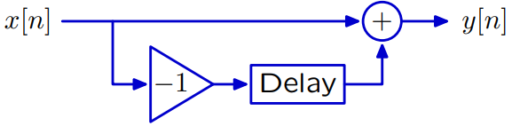

# MIT 6.003 Signals and Systems
- [MIT 6.003 Signals and Systems](#mit-6003-signals-and-systems)
  - [Signals and Systems](#signals-and-systems)
    - [Signals](#signals)
  - [Discrete-Time (DT) Systems](#discrete-time-dt-systems)
    - [Multiple representations of discrete time systems](#multiple-representations-of-discrete-time-systems)
      - [Verbal description](#verbal-description)
      - [Difference Equation](#difference-equation)
      - [Block diagram](#block-diagram)
      - [Signals](#signals-1)
      - [Operator Notation](#operator-notation)
  - [Feedback,](#feedback)
  - [Continuous-Time (CT) Systems](#continuous-time-ct-systems)
  - [Z Transform](#z-transform)
  - [Laplace Transform](#laplace-transform)
  - [Discrete Approximation of Continuous-Time Systems](#discrete-approximation-of-continuous-time-systems)
  - [Convolution](#convolution)
  - [Frequency Response](#frequency-response)
  - [Feedback and Control](#feedback-and-control)
  - [Continuous-Time (CT) Frequency Response and Bode Plot](#continuous-time-ct-frequency-response-and-bode-plot)
  - [Continuous-Time (CT) Feedback and Control, Part 1](#continuous-time-ct-feedback-and-control-part-1)
  - [Continuous-Time (CT) Feedback and Control, Part 2](#continuous-time-ct-feedback-and-control-part-2)
  - [Fourier Representations](#fourier-representations)
  - [Fourier Series](#fourier-series)
  - [Fourier Transform](#fourier-transform)
  - [Discrete-Time (DT) Frequency Representations](#discrete-time-dt-frequency-representations)
  - [Discrete-Time (DT) Fourier Representations](#discrete-time-dt-fourier-representations)
  - [Relations Among Fourier Representations](#relations-among-fourier-representations)
  - [Applications of Fourier Transforms](#applications-of-fourier-transforms)
  - [Sampling](#sampling)
  - [Sampling and Quantization](#sampling-and-quantization)
  - [Modulation, Part 1](#modulation-part-1)
  - [Modulation, Part 2](#modulation-part-2)
  - [Audio CD](#audio-cd)

---
## Signals and Systems
* We can represent systems as something that takes an input signal of choice and gives an output signal of choice.
* The representation doesn't depend upon the physical substrate.
* They can be easily combined.
* Signals are mathematical functions, with independent variable of time, and dependent variable (voltage, flow rate, etc.). If fact it can be multidimensionsl (rgbd-time).

### Signals
* Signals from physical systems are often functions of continuous time. Signals from computation systems are often functions of discrete time.
* Continuous signal can be converted to discrete signal by sampling at intervals.
* Discrete signals can be converted to continuous signal, e.g., by zero-order hold or piecewise linear. In hearing, zero-order hold makes us notices less error, but in vision linear interpolation makes us notice less error!

---
## Discrete-Time (DT) Systems
### Multiple representations of discrete time systems
#### Verbal description
To reduce the number of bits required to store a sequence of large numbers that are nearly equal, record the first number, and then record successive differences.

#### Difference Equation
Precise and concise.
$y[n]=x[n]-x[n-1]$
Declarative.

#### Block diagram

Unit sample or delta function:

$$\delta[n]=
\begin{cases}
1,\quad\text{if } n=0\\
0,\quad\text{otherwise}
\end{cases}$$

Delays start at rest with value 0.

Block diagram has more information: arrows. It's imperative.

Block diagrams can operate on signals (from samples).

#### Signals
Lumping all (possibly infinite) samples into a single object - signals.

Operators are means of communication: Add (sum two signals), Delay (shift whole signal to right 1 time step.)

#### Operator Notation
Let $\mathcal{R}$ represent the right-shift operator: $Y=\mathcal{R}\{X\}$ where $X$ represents the whole input signal ($x[n]$ for all $n$), and $Y$ is the whole output signal ($y[n]$ for all $n$).

$Y=X-\mathcal{R}X=(1-\mathcal{R})X$

---
## Feedback,
 Poles, and Fundamental Modes

---
## Continuous-Time (CT) Systems

---
## Z Transform

---
## Laplace Transform

---
## Discrete Approximation of Continuous-Time Systems

---
## Convolution

---
## Frequency Response

---
## Feedback and Control

---
## Continuous-Time (CT) Frequency Response and Bode Plot

---
## Continuous-Time (CT) Feedback and Control, Part 1

---
## Continuous-Time (CT) Feedback and Control, Part 2

---
## Fourier Representations

---
## Fourier Series

---
## Fourier Transform

---
## Discrete-Time (DT) Frequency Representations

---
## Discrete-Time (DT) Fourier Representations

---
## Relations Among Fourier Representations

---
## Applications of Fourier Transforms

---
## Sampling

---
## Sampling and Quantization

---
## Modulation, Part 1

---
## Modulation, Part 2

---
## Audio CD
