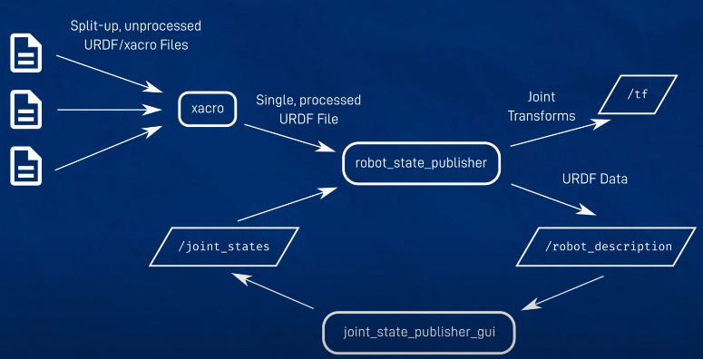
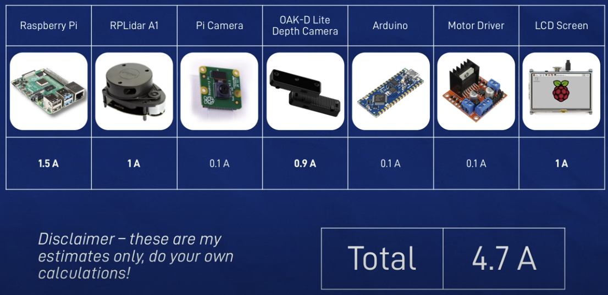
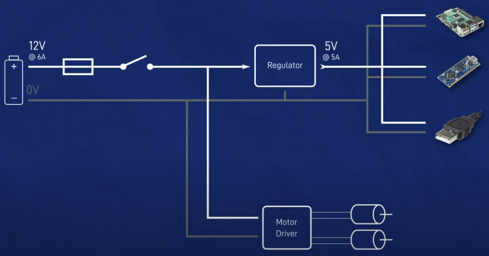
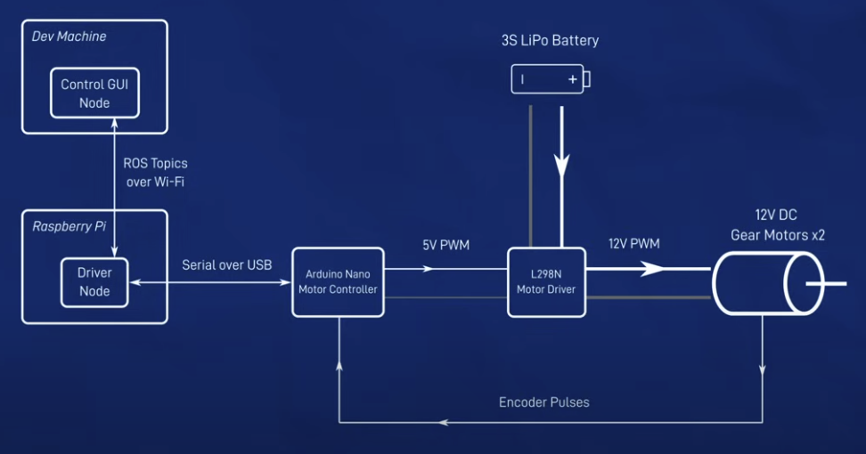
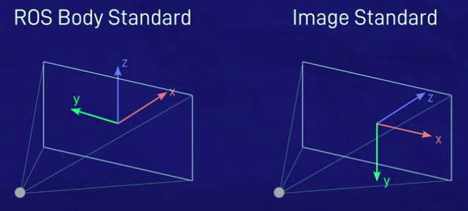

# Table of Contents

- [Table of Contents](#table-of-contents)
- [Log](#log)
  - [2025-](#2025-)
    - [November, 2025](#november-2025)
      - [November 14, 2025](#november-14-2025)
      - [November 12, 2025](#november-12-2025)
      - [November 11, 2025](#november-11-2025)
    - [September, 2025](#september-2025)
- [Docker for Robotics](#docker-for-robotics)
  - [ROS2 Dev Container Setup](#ros2-dev-container-setup)
- [Making a Mobile Robot](#making-a-mobile-robot)
  - [bluebot\_one](#bluebot_one)
  - [bluebotone\_controller](#bluebotone_controller)
  - [Project Overview](#project-overview)
    - [Making a Package](#making-a-package)
    - [Workspace Folder](#workspace-folder)
    - [Adding Files](#adding-files)
  - [Concept Design](#concept-design)
    - [URDF Design](#urdf-design)
      - [URDF Syntax](#urdf-syntax)
        - [Creating URDF](#creating-urdf)
      - [Links](#links)
      - [Joints](#joints)
      - [xacro](#xacro)
      - [Robot URDF Example](#robot-urdf-example)
    - [Gazebo Simulation](#gazebo-simulation)
      - [Gazebo tags](#gazebo-tags)
        - [Friction](#friction)
        - [Torque and Velocity](#torque-and-velocity)
        - [Spherical Collision](#spherical-collision)
      - [Controlling Gazebo via ROS](#controlling-gazebo-via-ros)
  - [Hardware](#hardware)
    - [The Brain - Raspberry Pi](#the-brain---raspberry-pi)
    - [Power Concenpts](#power-concenpts)
      - [Deciding Battery Voltage](#deciding-battery-voltage)
      - [Current Draw](#current-draw)
      - [Battery](#battery)
    - [LiDAR](#lidar)
      - [Connecting Physical LiDAR](#connecting-physical-lidar)
    - [Motors](#motors)
      - [L298N Motor Driver](#l298n-motor-driver)
      - [Motor-Driver-Arduino Pairing](#motor-driver-arduino-pairing)
      - [ROS Driver](#ros-driver)
    - [Camera](#camera)
      - [Camera and Images Fundamentals](#camera-and-images-fundamentals)
        - [Image Representation](#image-representation)
        - [Image Compression](#image-compression)
        - [Camera Parameter - Focal Length](#camera-parameter---focal-length)
        - [ROS-Camera/Image Integration](#ros-cameraimage-integration)
        - [Coordinate Systems](#coordinate-systems)
        - [Gazebo Camera Simulation](#gazebo-camera-simulation)
          - [Camera Xacro](#camera-xacro)
        - [Connecting a Real Camera and Getting Data](#connecting-a-real-camera-and-getting-data)
    - [Depth Camera](#depth-camera)
      - [Depth Camera Fundamentals](#depth-camera-fundamentals)
      - [ROS-Depth Camera Integration and Simulation](#ros-depth-camera-integration-and-simulation)
        - [Depth Camera Xacro](#depth-camera-xacro)
      - [Connecting a Real Depth Camera and Getting Data](#connecting-a-real-depth-camera-and-getting-data)
  - [Chassis Design](#chassis-design)
    - [Bench test components](#bench-test-components)
  - [Applications](#applications)
    - [ros2\_control](#ros2_control)
      - [Controller Manager](#controller-manager)
      - [Hardware Interfaces](#hardware-interfaces)
      - [Controllers](#controllers)
      - [Running the Controller Manager](#running-the-controller-manager)
      - [ros2 control in Simulation](#ros2-control-in-simulation)
        - [Installing dependencies](#installing-dependencies)
        - [Updating URDF](#updating-urdf)
        - [ROS2 Control Xacro](#ros2-control-xacro)
        - [Controller Config](#controller-config)
        - [Starting controllers](#starting-controllers)
      - [Extra bits](#extra-bits)
        - [Update the URDF to match robot structure](#update-the-urdf-to-match-robot-structure)
        - [Gazebo lag](#gazebo-lag)
        - [Wheel friction and RViz2 lag](#wheel-friction-and-rviz2-lag)
        - [Object scan move around for simulation](#object-scan-move-around-for-simulation)
      - [Driving Actual Robot using ROS2 Control](#driving-actual-robot-using-ros2-control)
      - [Hardware Interface](#hardware-interface)
      - [Update the URDF](#update-the-urdf)
        - [Launch File](#launch-file)
        - [Setting up controller manager](#setting-up-controller-manager)
      - [Testing the real robot](#testing-the-real-robot)
        - [Switch real and gazebo controller manager](#switch-real-and-gazebo-controller-manager)
    - [Teleoportation](#teleoportation)
        - [Getting feedback using RViz2](#getting-feedback-using-rviz2)
    - [SLAM](#slam)
      - [ROS and SLAM](#ros-and-slam)
      - [Running on real robot](#running-on-real-robot)
    - [Phone Control](#phone-control)
    - [Nav2](#nav2)
      - [Nav2 on real robot](#nav2-on-real-robot)
    - [Adding Screen](#adding-screen)
    - [Object Tracking](#object-tracking)
    - [Additional Hardware](#additional-hardware)
  - [Humble](#humble)
  - [New Gazebo](#new-gazebo)

---
# Log
## 2025-
### November, 2025
#### November 14, 2025
- [x] Realized that Pi uses ROS Jazzy - whereas the drivers and code assume ROS humble -> try the Jetson again.
- [x] While Jazzy fails, Humble runs launch_robot.launch.py.
- [x] LiDAR works.
- [ ] But the wheels still don't rotate for unstamped Teleop.
  - [x] Pyserial still works.
- [ ] Why did I shifted from Jetson to Pi -> I think the camera wasn't working right, and I need a new battery/chassis to support it.

#### November 12, 2025
- [x] launch_sim.launch.py works with humble teleop.
- [x] Matched the config, description and lanunch failes against articubot_one new_gazebo branch files - they match.
- [x] Check the launch_robot.launch.py error with gemini - changed <plugin>diffdrive_arduino/DiffDriveArduinoHardware</plugin> to <plugin>diffdrive_arduino/DiffDriveArduino</plugin>, added use_stamped: false to twist_mux.yaml, checked URDF files - still <ros2_control name = "RealRobot" ...> is failing.

#### November 11, 2025
- [x] Diffdrive Arduino installation fails. `git clone -b humble https://github.com/Buzzology/diffdrive_arduino.git` worked.
- [ ] Teleop operation not working.
  - [x] Check if motor control over serial works -> it works for `/dev/ttyACM0`.
  - [x] Check if serial_motor_demo GUI control works -> it works. So the hardware connections are OK.


### September, 2025
- Managed to run LiDAR, but not rplidar.launch.pi
- Managed to run 

# Docker for Robotics

## ROS2 Dev Container Setup

- Install Docker Engine for Ubuntu using the convenience script and post-installation steps.
- Install Remote Development extension in VSCode.
- Install and configure NVIDIA Container Toolkit.
- Disconnect VPN.
- Don't install Python/Anaconda.
- Install correct CUDA for latest PyTorch (default CUDA may be fine), install default PyTorch.

```json
{
  "name": "humble desktop-full",
  "dockerFile": "Dockerfile",
  "runArgs": [
    "--privileged",
    "--network=host",
    "--gpus","all"
  ],
  "workspaceMount": "source=${localWorkspaceFolder},target=/${localWorkspaceFolderBasename},type=bind",
  "workspaceFolder": "/${localWorkspaceFolderBasename}",
  "mounts": [
    "source=${localEnv:HOME}${localEnv:USERPROFILE}/.bash_history,target=/home/vscode/.bash_history,type=bind"
  ],
  "features": {
    "ghcr.io/devcontainers/features/desktop-lite:1": {},
    "ghcr.io/devcontainers/features/nvidia-cuda:1": {},
    "ghcr.io/raucha/devcontainer-features/pytorch:1": {}
  }
}
```

**Running GUI**

```bash
xhost +local:
```
In terminal, and rebuild container.

---

# Making a Mobile Robot
## bluebot_one
- build the physical robot
- clone and build package
- test the launcher files

## bluebotone_controller

## Project Overview

Install ROS2

```bash
nano ~/.bashrc  
# add: source /opt/ros/${ROS_DISTRO}/setup.bash  
source ~/.bashrc  
```

### Making a Package
While working on a project with ROS, we keep all our code and files in a package.

### Workspace Folder
Make workspace folders in the Pi and the dev machine.  
Create a workspace folder/src folder. Clone your packages. Go back to the workspace folder and run colcon build. Source the workspace.

### Adding Files

You can copy `blue_bot` and `blue_bot_controller` folders to your `/src` folder, change directory to the ws folder, and run:

```bash
colcon build --symlink-install
source install/setup.bash
```

Run the `/robot_state_publisher` by running the launch file:

```bash
ros2 launch blue_bot rsp.launch.py
```

---


## Concept Design
### URDF Design

**Differential Drive:** Robot with two wheels driving it.

**Base link:** Main coordinate system: x-pointing forward, y-pointing left, z-pointing up.



The main coordinate frame of the robot is called `base_link` with x pointing forward, y pointing left, z pointing up.

We start with config files written in URDF format that altogether describe the structure of the robot. These are combined using xacro into a single processed URDF file.

This URDF robot structure is passed to `robot_state_publisher`. This makes URDF data in `/robot_description` topic, and broadcasts appropriate transforms `/tf`.

If any joint moves, `robot_state_publisher` expects the input to be published on the `/joint_states` topic.

While testing, we can use the `/joint_state_publisher_gui` to fake these values.

We run all of these files using launch files.

Every time we add a URDF file, we need to run:

```bash
colcon build --symlink-install
source install/setup.bash
```

After change, we need to quit and relaunch `/robot_state_publisher`. If RViz doesn't show updates in URDF visualization, refresh.


#### URDF Syntax

URDF is based on XML, where everything is represented as a series of tags nested inside each other.

```xml
<?xml version="1.0"?>
<robot name="my_bot">
  <link name="link_name"></link>
  <joint name="joint_name"></joint>
  <link></link>
  ...
</robot>
```

##### Creating URDF

In `workspace/src/`, we have `blue_bot/description/robot.urdf.xacro`:

```xml
<?xml version="1.0"?>
<robot xmlns:xacro="http://www.ros.org/wiki/xacro" name="robot">
  <!-- we'll add the robot_core.xacro -->
  <xacro:include filename="robot_core.xacro" />
</robot>
```

Now add a new file `robot_core.xacro` in the same directory.

Install joint_state_publisher_gui:

```bash
sudo apt install ros-${ROS_DISTRO}-joint-state-publisher-gui
```

---

#### Links

Each `<link>` tag represents one link. It must have a name, but can also have 3 additional properties:

- `<visual>`
  - `<geometry>`: defines the overall shape (box, cylinder, sphere, path to a 3d mesh)
  - `<origin>`: offset for the geometry, so that it doesn't have to center around the origin.
  - `<material>`: for color

- `<collision>`: for physics calculations, includes `<geometry>` and `<origin>` that can be copied from `<visual>`. This can be made simple for computational savings.

- `<inertial>`: for physics calculation - how the links react to forces.
  - `<mass>`
  - `<origin>`: the center of gravity, for most cases the same as visual and collision origin.
  - `<inertia>`: rotational inertia matrix.

**Link coordinate system:** If the `link` can rotate, it should have the origin at the pivot point.

**Link joints:** Joints show relation of the origin and coordinate frame of the links, which determines the position and orientation of the links.

**Link motion:**
- *Revolute*: rotational motion about a point, with fixed start and stop angle.
- *Continuous*: rotational motion about a point, without fixed limit - wheel.
- *Prismatic*: linear translational motion.
- *Fixed*: child link doesn't move relative to the parent link.

---

#### Joints

Joints specify where the links are in space.

```xml
<joint name="arm_joint" type="revolute">
  <parent link="slider_link"/>
  <child link="arm_link"/>
  <origin xyz="0.25 0 0.15" rpy="0 0 0"/>
  <axis xyz="0 -1 0"/>
  <limit lower="0" upper="${pi/2}" velocity="100" effort="100"/>
</joint>
```

Other tags include `<material>` for colors, `<gazebo>` for simulation, `<transmission>` for actuator connection.

Naming convention: `_link`, `_joint` (e.g., `arm_link` is the child link in `arm_joint`).

---

#### xacro

XML macro (xacro) helps with URDF files:
- Splitting URDF into multiple files
- Avoidance of repetition

To add xacro in a URDF file:

```xml
<robot xmlns:xacro="http://www.ros.org/wiki/xacro">
```

xacro compiles split URDF files into one URDF, which is fed to robot_state_publisher, which publishes the complete URDF on `/robot_description` topic.

**Example:**

`my_robot.urdf.xacro`
```xml
<?xml version="1.0"?>
<robot xmlns:xacro="http://www.ros.org/wiki/xacro" name="my_robot">
  <xacro:include filename="my_materials.xacro"/>
  <link>...</link>
  <joint>...</joint>
</robot>
```

`my_materials.xacro`
```xml
<?xml version="1.0"?>
<robot xmlns:xacro="http://www.ros.org/wiki/xacro">
  <material name="white">
    <color rgba="1 1 1 1"/>
  </material>
</robot>
```

**Properties:**
```xml
<xacro:property name="arm_radius" value="0.5"/>
<cylinder radius="${arm_radius}" length="7"/>
```

**Math operations:**
```xml
<cylinder length="${4*arm_radius*pi1}"/>
```

**Macros:**
```xml
<xacro:macro name="inertial_box" params="mass x y z *origin">
  <inertial>
    <xacro:insert_block name="origin"/>
    <mass value="${mass}"/>
    <inertia ixx="${(1/12) * mass * (y*y+z*z)}"/>
  </inertial>
</xacro:macro>
```

Usage:
```xml
<xacro:inertial_box mass="12" x="2" y="3" z="4">
  <origin xyz="0 2 4" rpy="0 0 0"/>
</xacro:inertial_box>
```

---

#### Robot URDF Example

```xml
<?xml version="1.0"?>
<robot xmlns:xacro="http://www.ros.org/wiki/xacro">

  <xacro:include filename="inertial_macros.xacro" />

  <!-- Define colors -->
  <material name="white">
    <color rgba="1 1 1 1"/>
  </material>
  <material name="black">
    <color rgba="0 0 0 1"/>
  </material>
  <material name="orange">
    <color rgba="1 0.3 0.1 1"/>
  </material>
  <material name="blue">
    <color rgba="0.2 0.2 1 1"/>
  </material>

  <!-- BASE_LINK -->
  <link name="base_link"></link>

  <!-- CHASSIS LINK -->
  <joint name="chassis_joint" type="fixed">
    <parent link="base_link"/>
    <child link="chassis"/>
    <origin xyz="0 0 0"/>
  </joint>
  <link name="chassis">
    <visual>
      <origin xyz="0 0 0.0625"/>
      <geometry>
        <cylinder radius="0.08" length="0.125"/>
      </geometry>
      <material name="blue"/>
    </visual>
    <collision>
      <origin xyz="0 0 0.0625"/>
      <geometry>
        <cylinder radius="0.08" length="0.125"/>
      </geometry>
    </collision>
    <xacro:inertial_cylinder mass="2.0" length="0.125" radius="0.08">
      <origin xyz="0 0 0.0625" rpy="0 0 0"/>
    </xacro:inertial_cylinder>
  </link>

  <!-- LEFT WHEEL LINK -->
  <joint name="left_wheel_joint" type="continuous">
    <parent link="base_link"/>
    <child link="left_wheel"/>
    <origin xyz="0 0.08 0" rpy="-${pi/2} 0 0"/>
    <axis xyz="0 0 1"/>
  </joint>
  <link name="left_wheel">
    <visual>
      <geometry>
        <cylinder radius="0.0325" length="0.02"/>
        <material name="black"/>
      </geometry>
    </visual>
    <collision>
      <geometry>
        <cylinder radius="0.0325" length="0.02"/>
      </geometry>
    </collision>
    <xacro:inertial_cylinder mass="0.5" length="0.02" radius="0.0325">
      <origin xyz="0 0 0" rpy="0 0 0"/>
    </xacro:inertial_cylinder>
  </link>

  <!-- RIGHT WHEEL LINK -->
  <joint name="right_wheel_joint" type="continuous">
    <parent link="base_link"/>
    <child link="right_wheel"/>
    <origin xyz="0 -0.08 0" rpy="${pi/2} 0 0"/>
    <axis xyz="0 0 -1"/>
  </joint>
  <link name="right_wheel">
    <visual>
      <geometry>
        <cylinder radius="0.0325" length="0.02"/>
        <material name="black"/>
      </geometry>
    </visual>
    <collision>
      <geometry>
        <cylinder radius="0.0325" length="0.02"/>
      </geometry>
    </collision>
    <xacro:inertial_cylinder mass="0.5" length="0.02" radius="0.0325">
      <origin xyz="0 0 0" rpy="0 0 0"/>
    </xacro:inertial_cylinder>
  </link>

  <!-- Front Caster Wheel Link -->
  <joint name="front_caster_wheel_joint" type="fixed">
    <parent link="chassis"/>
    <child link="front_caster_wheel"/>
    <origin xyz="0.07 0 0"/>
  </joint>
  <link name="front_caster_wheel">
    <visual>
      <geometry>
        <sphere radius="0.0325"/>
      </geometry>
      <material name="black"/>
    </visual>
    <collision>
      <geometry>
        <sphere radius="0.0325"/>
      </geometry>
    </collision>
    <xacro:inertial_sphere mass="0.5" radius="0.0325">
      <origin xyz="0 0 0" rpy="0 0 0"/>
    </xacro:inertial_sphere>
  </link>

  <!-- Back Caster Wheel Link -->
  <joint name="back_caster_wheel_joint" type="fixed">
    <parent link="chassis"/>
    <child link="back_caster_wheel"/>
    <origin xyz="-0.07 0 0"/>
  </joint>
  <link name="back_caster_wheel">
    <visual>
      <geometry>
        <sphere radius="0.0325"/>
      </geometry>
      <material name="black"/>
    </visual>
    <collision>
      <geometry>
        <sphere radius="0.0325"/>
      </geometry>
    </collision>
    <xacro:inertial_sphere mass="0.5" radius="0.0325">
      <origin xyz="0 0 0" rpy="0 0 0"/>
    </xacro:inertial_sphere>
  </link>

</robot>
```

After adding wheel link, run:

```bash
ros2 run joint_state_publisher_gui joint_state_publisher_gui
```

before opening RViz2.

In RViz, set `Global Options > Fixed Frame` to `base_link`. Add `/tf`, show names. Add robot body and set `Description Topic` to `/robot_description`.

---

### Gazebo Simulation

Robot launcher:

```bash
ros2 launch blue_bot rsp.launch.py use_sim_time:=true
```

Install Gazebo:
```bash
sudo apt install ros-${ROS_DISTRO}-ros-gz
```

Gazebo launcher:

```bash
ros2 launch ros_gz_sim gz_sim.launch.py gz_args:=empty.sdf
```

Entity spawner in gazebo:

```bash
ros2 run ros_gz_sim create -topic robot_description -name my_bot -z 0.1 -name bluebot_one -z 0.1 # spawn the robot a little in the air (positive z) to avoid clippin in floor
```

Combining these 3 with a single launcher file:

```python
import os

from ament_index_python.packages import get_package_share_directory

from launch import LaunchDescription
from launch.actions import IncludeLaunchDescription, DeclareLaunchArgument
from launch.launch_description_sources import PythonLaunchDescriptionSource
from launch.substitutions import LaunchConfiguration

from launch_ros.actions import Node


def generate_launch_description():


    # Include the robot_state_publisher launch file, provided by our own package. Force sim time to be enabled
    # !!! MAKE SURE YOU SET THE PACKAGE NAME CORRECTLY !!!

    package_name='bluebot_one' #<--- CHANGE ME

    rsp = IncludeLaunchDescription(
                PythonLaunchDescriptionSource([os.path.join(
                    get_package_share_directory(package_name),'launch','rsp.launch.py'
                )]), launch_arguments={'use_sim_time': 'true'}.items()
    )
    
    world = LaunchConfiguration('world')

    world_arg = DeclareLaunchArgument(
        'world',
        default_value="empty.sdf",
        description='World to load'
        )

    # Include the Gazebo launch file, provided by the ros_gz_sim package
    gazebo = IncludeLaunchDescription(
                PythonLaunchDescriptionSource([os.path.join(
                    get_package_share_directory('ros_gz_sim'), 'launch', 'gz_sim.launch.py')]),
                    launch_arguments={'gz_args': ['-r -v4 ', world], 'on_exit_shutdown': 'true'}.items()
             )

    # Run the spawner node from the ros_gz_sim package. The entity name doesn't really matter if you only have a single robot.
    spawn_entity = Node(package='ros_gz_sim', executable='create',
                        arguments=['-topic', 'robot_description',
                                   '-name', 'my_bot',
                                   '-z', '0.1'],
                        output='screen')


    # Launch them all!
    return LaunchDescription([
        rsp,
        world_arg,
        gazebo,
        spawn_entity,
    ])
```

Now launch using the combined launcher:

```bash
ros2 run gazebo_ros launch_sim.launch.py
```

#### Gazebo tags
```xml
<link name="my_link">
    <!-- All the stuff that is inside the link tag -->
</link>

<gazebo reference="my_link">
    <!-- Gazebo-specific parameters for that link -->
</gazebo>

<gazebo>
    <!-- Gazebo parameters that are not specific to a link -->
</gazebo>


```
##### Friction
Remove friction from caster wheels:
```xml
<gazebo reference="caster_wheel">
        <mu1 value="0.0"/>
        <mu2 value="0.0"/>
</gazebo>
```

##### Torque and Velocity

Limit the torque and velocity of drive wheels.

```xml
<joint name="left_wheel_joint" type="continuous">
  <!-- ... -->
  <limit effort="0.05" velocity="10.0"/>
</joint>
```

##### Spherical Collision
Instead of cylinder to minimize odometry error.
```xml
    <link name="left_wheel">
        <visual>
          <!-- ... -->
        </visual>
        <collision>
            <geometry>
                <sphere radius="0.05" />
            </geometry>
        </collision>
```

#### Controlling Gazebo via ROS
We'll use `ros2_control` later. A control system takes command velocity input (how fast we want the robot to move), translate that into motor commands for the motor drivers, read the actual motor speeds, calculate true velocity. The command velocity topic is `/cmd_vel` of type `Twist` - 6 numbers xyz linear and angular (diff drive can only control linear x and angular z), or `TwistStamped` that adds time.

Robot position can be estimated by dead reckoning - integrating velocity over time.

---

## Hardware
### The Brain - Raspberry Pi
- **PC**
  - 64-bit
  - RAM: >= 4GB
  - Storage: >=
  - 5V low current
- **OS**
  - ROS compatible Ubuntu
- **Software**
  - Git
  - Openssh-server
  - Arduino IDE
  - VS Code
- **Networking:** Remote PC and Pi on the same network with internet
- **ROS**
  - Install main packages following official instructions
  - Install colcon
  - Setup environment
- **Setup workspace and packages**

---

### Power Concenpts

| Name    | Other Names        | Units              | Symbol | Water Analogy         |
| ------- | ------------------ | ------------------ | ------ | --------------------- |
| Voltage | Potential Diff.    | Volts (V)          | V      | Water Pressure        |
| Current | Amperage           | Amperes/Amps (A)   | I      | Flow Rate of Water    |
| Power   | Wattage            | Watts (W)          | P      | Power of Flow         |

- $P=VI$. Power in supplier indicates the max power it can provide (5W with 5V-1A) or draw.
- Most electrical components use 5V.
- Motors draw more.
- Use switching regulator/buck converter to convert high voltage into 5V.

#### Deciding Battery Voltage

12V for DC motors.

#### Current Draw



- The demand is about 5A. So the regulator needs to be capable of delivering $5V\times 5A=25W$ of power.
- The supply is $25W/12V\approx 2.1\rightarrow 2.5A$
- Motor demand: highest (stall) current draw * 2 $1.8A\times 2=3.6A$
- Total current $2.5+3.6=6.1A$

#### Battery

LiPo

- S number: number of cells
- Cell voltage: nominally 3.7V (11.1 for 3S); safe range 3.2V-4.2V (**3S 9.6V-12.6V**)
- Capacity: how much mA it takes to empty the battery in 1 hour - 3000 mAh battery could run for 30 minutes at 6A. But you'd want to use at most 2/3.
- C number: max discharge current = C number $\times$ capacity. 3000 mAh $\times$ 20C = 60A max current (draining the battery in 3 minutes!).

LiPo needs careful handling.

- Check voltage regularly
- Charge with a good charger at a fireproof setup
- Make sure the wiring (gauge) and connector current carrying capacity. For example, breadboards can only handle milliamps.
- Pi can handle specific current flow, so external devices should be powered separately, with a USB hub for instance.
- We also need switch and fuse for safety.



---

### LiDAR
Can be based on sound or light, 1/2/3D.

In ROS, different LiDAR are subscribed using `/scan`.

In the robot description `robot.urdf.xacro`, add another xacro file for lidar.

**LiDAR xacro:**

```xml
<?xml version="1.0"?>
<robot xmlns:xacro="http://www.ros.org/wiki/xacro" >

    <joint name="laser_joint" type="fixed">
        <parent link="chassis"/>
        <child link="laser_frame"/>
        <origin xyz="0.1 0 0.175" rpy="0 0 0"/>
    </joint>

    <link name="laser_frame">
        <visual>
            <geometry>
                <cylinder radius="0.05" length="0.04"/>
            </geometry>
            <material name="red"/>
        </visual>
        <collision>
            <geometry>
                <cylinder radius="0.05" length="0.04"/>
            </geometry>
        </collision>
        <xacro:inertial_cylinder mass="0.1" length="0.04" radius="0.05">
            <origin xyz="0 0 0" rpy="0 0 0"/>
        </xacro:inertial_cylinder>
    </link>


    <gazebo reference="laser_frame">
        <material>Gazebo/Red</material>

        <sensor name="laser" type="ray">
            <pose> 0 0 0 0 0 0 </pose>
            <visualize>true</visualize>
            <update_rate>10</update_rate>
            <ray>
                <scan>
                    <horizontal>
                        <samples>360</samples>
                        <min_angle>-3.14</min_angle>
                        <max_angle>3.14</max_angle>
                    </horizontal>
                </scan>
                <range>
                    <min>0.3</min>
                    <max>12</max>
                </range>
            </ray>
            <plugin name="laser_controller" filename="libgazebo_ros_ray_sensor.so">
                <ros>
                    <argument>~/out:=scan</argument>
                </ros>
                <output_type>sensor_msgs/LaserScan</output_type>
                <frame_name>laser_frame</frame_name>
            </plugin>
        </sensor>
    </gazebo>

</robot>
```

In RViz2, add LaserScan topic.

#### Connecting Physical LiDAR

On Pi, install rplidar driver with `sudo apt install ros-${ROS_DISTRO}-rplidar-ros`.

To figure out the USB where the LiDAR is connected:

```bash
ls /dev/serial/by-path/
```

Run:

```bash
ros2 run rplidar_ros rplidar_composition --ros-args  -p serial_port:=/dev/ttyUSB0 -p serial_baudrate:=115200 -p frame_id:=laser_frame -p inverted:=false -p angle_compensate:=true -p scan_mode:=Standard
```

On dev machine, launch `RViz2`. If the robot state publisher is not published, select Fixed Frame `laser_frame`.

To start/stop LiDAR motor:

```bash
ros2 service call /stop_motor std_srvs/srv/Empty {}
```
---

### Motors

- Robot controller (e.g., Pi calculating required speed)
  - Comms layer: computer to motor controller (e.g., USB serial)
    - closed-loop or feedback control (e.g., PID control takes motor measurement and adjusts target speed)
      - open-loop control (map joystick button to target speed)
        - motor controller (takes target-speed/position, outs low-voltage signal)
          - motor driver (takes low-voltage signal and current, outs amplified high-voltage signal)
            - voltage signal
              - 12V DC motor



#### L298N Motor Driver

- It has 12V in for motors, and 5V in for the L298N chip.
- Pair of terminals in each side are for the motors.

#### Motor-Driver-Arduino Pairing

- Upload driver code on the Arduino
- Connect Arduino to the motor driver
Arduino		L298N
- D10		L Fwd - IN2
- D6		L Rev - IN1
- D9		R Fwd - IN3
- D5		R Rev - IN4

Arduino		Encoder pin
- Gnd		Black
- 5V		Blue
- D2		Left A (Left Green)
- D3		Left B (Left Yellow)
- A4		Right A (Right Yellow)
- A5		Right B (Right Green)

- Install pyserial (`pip install pyserial`)
- Check the USB in which the Arduino is connected (e.g., `/dev/ttyUSB0` or `/dev/ttyACM0`). You can unplug the Arduino, run `ls -l /dev/tty*`, plugin Arduino and run `ls -l /dev/tty*` again, and check the difference.
- Check if the motor control works using pyserial (by sending serial command): (in Pi) `python3 -m serial.tools.miniterm /dev/ttyUSB0 57600 --echo` or (in Jetson) `python3 -m serial.tools.miniterm /dev/ttyACM0 57600 --echo`
  - `e` for checking current speed
  - `r` to reset
  - `o (+/-)0-255 (+/-)0-255` for spinning at variable speed with open-loop control
  - `m (+/-)0-255 (+/-)0-255` for spinning at variable speed with closed-loop control

- The motor encoders can have 4 wires - two will go to 5V and Gnd to power the encoder circuit, two will go to Arduino input.
- After connecting the encoder to the Arduino, check if rotating the wheel gives positive return (r in miniterm). Otherwise, swap the motor power wires.
- Rotate the wheel by n times, get encoder reading e (e in miniterm), e/n is rev of encoders per rev of wheel. For my first motor, it's about 1970.
- In the Arduino code, PID loop runs 30 loops/sec, number of encoder counts per PID loop = (e/n)/30=1970/30=66 - is the magnitude (range 0-255) for 1 rev/sec. But after testing closed loop, m 36 gives approx 1 rev, which makes e/n=36*30=1080


#### ROS Driver

Demo driver with two nodes, an encoder listener in topic and send them to the controller, another GUI for sending commands.

On the both the dev machine and PI:

- Clone https://github.com/joshnewans/serial_motor_demo in workspace (src) folder, build, source.

```bash
ros2 run serial_motor_demo driver --ros-args -p serial_port:=/dev/ttyUSB0 -p baud_rate:=57600 -p loop_rate:=30 -p encoder_cpr:=1080

#or
ros2 run serial_motor_demo driver --ros-args -p serial_port:=/dev/ttyACM0 -p baud_rate:=57600 -p loop_rate:=30 -p encoder_cpr:=1080

```

`Error: Serial timeout on command: e` is OK.

On the dev machine:

```bash
ros2 run serial_motor_demo gui
```

---

### Camera

#### Camera and Images Fundamentals

- Types: RGB, infrared, thermal, wide angle, telephoto
- Capture light through a lens, aperture, onto a sensor.

##### Image Representation

Stored in 2D array of pixels. For RGB, 3 color channels per pixel (0-255).

##### Image Compression

PNG is lossless, JPEG is lossy.

##### Camera Parameter - Focal Length

Affects horizontal Field of View (FOV):

$$
\text{h\_fov}=2\tan^{-1}\left(\frac{\text{sensor\_width}}{2\times \text{focal\_length}}\right)
$$

---

##### ROS-Camera/Image Integration

- Driver node communicates with hardware, publishes to `sensor_msgs/Image` and `sensor_msgs/CompressedImage`.
- The published unprocessed image is called `/image_raw` or `/image_raw/compressed`.
- `sensor_msgs/CameraInfo` contains camera related info.

---

##### Coordinate Systems

- **ROS:** Right-hand rule, `camera_link` (x-forward, y-left, z-up)
- **Camera:** Left-hand rule, `camera_link_optical` (x-left to right, y-top to bottom, z-away from camera)



---

##### Gazebo Camera Simulation

In the robot description `robot.urdf.xacro`, add another xacro file for camera.

###### Camera Xacro

```xml
<?xml version="1.0"?>
<robot xmlns:xacro="http://www.ros.org/wiki/xacro" >

    <joint name="camera_joint" type="fixed">
        <parent link="chassis"/>
        <child link="camera_link"/>
        <origin xyz="0.305 0 0.08" rpy="0 0 0"/>
    </joint>

    <link name="camera_link">
        <visual>
            <geometry>
                <box size="0.010 0.03 0.03"/>
            </geometry>
            <material name="red"/>
        </visual>
    </link>


    <joint name="camera_optical_joint" type="fixed">
        <parent link="camera_link"/>
        <child link="camera_link_optical"/>
        <origin xyz="0 0 0" rpy="${-pi/2} 0 ${-pi/2}"/>
    </joint>

    <link name="camera_link_optical"></link>


    <gazebo reference="camera_link">
        <material>Gazebo/Red</material>

        <sensor name="camera" type="camera">
            <pose> 0 0 0 0 0 0 </pose>
            <visualize>true</visualize>
            <update_rate>10</update_rate>
            <camera>
                <horizontal_fov>1.089</horizontal_fov>
                <image>
                    <format>R8G8B8</format>
                    <width>640</width>
                    <height>480</height>
                </image>
                <clip>
                    <near>0.05</near>
                    <far>8.0</far>
                </clip>
            </camera>
            <plugin name="camera_controller" filename="libgazebo_ros_camera.so">
                <frame_name>camera_link_optical</frame_name>
            </plugin>
        </sensor>
    </gazebo>

</robot>

```

Install compressed image transport plugins:

```bash
sudo apt install ros-${ROS_DISTRO}-image-transport-plugins
sudo apt install ros-${ROS_DISTRO}-rqt-image-view
```

View compressed image:

```bash
ros2 run rqt_image_view rqt_image_view
ros2 run image_transport list_transports
ros2 run image_transport republish compressed raw --ros-args -r in/compressed:=/camera/image_raw/compressed -r out:=/camera/image_raw/uncompressed
```

---

##### Connecting a Real Camera and Getting Data

Install camera on Pi:

```bash
sudo apt install libraspberrypi-bin v4l-utils ros-${ROS_DISTRO}-v4l2-camera ros-${ROS_DISTRO}-image-transport-plugins
sudo apt-get install ros-$ROS_DISTRO-camera-ros # for jazzy

groups # check if video is in groups, if not:
sudo usermod -aG video $USER # add video to group > reboot
vcgencmd get_camera # check if camera is connected to the pi
raspistill -k # shows camera feed. Press x > Enter to close
v4l2-ctl --list-devices # check if video for linux subsystem can see camera
sudo apt install ros-${ROS_DISTRO}-rqt-image-view
```


Run the camera:

```bash
ros2 run v4l2_camera v4l2_camera_node --ros-args -p image_size:="[640,480]" -p camera_frame_id:=camera_link_optical
# or
ros2 launch camera.launch.py
```

On a new terminal:

```bash
ros2 run rqt_image_view rqt_image_view
```

Camera launch file:
```python
import os

from launch import LaunchDescription
from launch_ros.actions import Node

def generate_launch_description():


    return LaunchDescription([

        Node(
            package='v4l2_camera',
            executable='v4l2_camera_node',
            output='screen',
            parameters=[{
                'image_size': [640,480],
                'camera_frame_id': 'camera_link_optical'
                }]
    )
    ])

```

---
### Depth Camera
#### Depth Camera Fundamentals

- Major types:
  - Structured light: emit light (e.g., IR) and record
  - Time-of-Flight: emit light, record time of return.
  - Stereo: record with two cameras.
- Pipeline: raw data > depth processing > depth image > 3D projection > point cloud
- Just like normal image, depth image has topics and transprot.
- **Storage**: depth data is stored as 32-bit Float in meters, or 16-bit Uint in mm.
- The depth image can be viewed. In such case the image is normalized - the furthest thing is white and the closest thing is black.
- ROS `depth_image_proc` package includes depth image related tools. This includes converting 16-bit UInt to 32-bit float, generating point cloud, aligning RGB-D.

#### ROS-Depth Camera Integration and Simulation

In the robot description `robot.urdf.xacro`, add another xacro file for depth camera in place of the Camera Xacro.

##### Depth Camera Xacro

```xml
<?xml version="1.0"?>
<robot xmlns:xacro="http://www.ros.org/wiki/xacro" >

    <joint name="camera_joint" type="fixed">
        <parent link="chassis"/>
        <child link="camera_link"/>
        <origin xyz="0.305 0 0.08" rpy="0 0 0"/>
    </joint>

    <link name="camera_link">
        <visual>
            <geometry>
                <box size="0.010 0.03 0.03"/>
            </geometry>
            <material name="red"/>
        </visual>
    </link>


    <joint name="camera_optical_joint" type="fixed">
        <parent link="camera_link"/>
        <child link="camera_link_optical"/>
        <origin xyz="0 0 0" rpy="${-pi/2} 0 ${-pi/2}"/>
    </joint>

    <link name="camera_link_optical"></link>


    <gazebo reference="camera_link">
        <material>Gazebo/Red</material>

        <sensor name="camera" type="depth">
            <pose> 0 0 0 0 0 0 </pose>
            <visualize>true</visualize>
            <update_rate>10</update_rate>
            <camera>
                <horizontal_fov>1.089</horizontal_fov>
                <image>
                    <format>B8G8R8</format>
                    <width>640</width>
                    <height>480</height>
                </image>
                <clip>
                    <near>0.05</near>
                    <far>8.0</far>
                </clip>
            </camera>
            <plugin name="camera_controller" filename="libgazebo_ros_camera.so">
                <frame_name>camera_link_optical</frame_name>
                <min_depth>0.1</min_depth>
                <max_depth>100.0</max_depth>
            </plugin>
        </sensor>
    </gazebo>

</robot>
```

Since we added a new file, build and source the workspace.

```bash
colcon build --symlink-install
source install/setup.bash
```
Run gazebo launcher and `RViz2`, add `point cloud`, select `/camera/points` topic to view.


#### Connecting a Real Depth Camera and Getting Data
`lsusb` to check if depth camera is connected via USB. Install drivers.

---

## Chassis Design
### Bench test components
Check if Pi is undervoltaged:
```bash
vcgencmd get_throttled # 0X0 is not throttled
```
If the Pi is getting low-voltage, probe in key connections (regulator, terminal, Pi pins) to find where the drop is occuring.

Connect all the components (motors, camera, LiDAR) and see if they work.

`journalctl -fe` checks if the Pi is looking for a display continuously. `systemctl get-default` shows the default startup target (e.g., graphical target). `systemctl set-default multi-user.target` to change, and `systemctl set-default graphical.target` to swap back > `reboot`.

Clone and build workspace > Chassis design

---
## Applications

---
### ros2_control
Fast common framework between drivers for different hardware platforms and control algorithms.

#### Controller Manager

The center of ros2 control is **Controller manager** that links controllers and hardware drivers.

#### Hardware Interfaces
It has **hardware interfaces** or hardware component that speaks to different languages of hardwares and exposes them to controller. Hardwares are represented with **command interfaces (read/write)** or **state interfaces (real only)**.  An actuator can have multiple command interfaces, e.g., it can be controlled by either speed or torque. For motors, we can only control it, making it a command interface. But we can monitor the speed, position with encoders, making them state interfaces. For the two motors, we have two command interfaces (one for velocity of each motor), and four state interfaces (position and velocity of each wheel).  

With motors and their hardware interfaces loaded, `ros2 control list_hardware_interfaces` returns command and state interfaces. ROS2 control doesn't know or care which one does what. **Resource Manager** takes all command and state interfaces and publishes as a list, accessible by the controllers. We associate hardware interfaces with actual hardware by adding them into the URDF using `<ros2_control>` tag - and the **Resource Manager** knows about the hardware interfaces from the URDF.

#### Controllers
are how the rest of the ROS ecosystem interact with ros2_control. On one end, they listen to ros_topics for control input - joint positions or body velocities - they take the input and use some alogirhtm to figure out the appropriate actuator speeds, positions, etc. They can also publish to ROS topics for command feedback or state information, and a single controller can pass information in either or both directions. There are controllers that don't control anything, just publishes sensor/feedback data.

**Control Manager and Controllers**: The controller manager loads listed controllers and matches them with the right command and state interfaces the resource manager is exposing. To set up the controller, we write a yaml file with parameters, and pass that to the controller manager. From there we can tell it to start/stop controller as needed. We can have multiple controllers in one robot - as long as they are not trying to control the same command interface (real-only state interfaces can be shared).  

While the hardware interfaces is designed for specific hardwares, the controllers are designed for robot applications. ROS2 control packages has built in controllers for common needs, like the `diff_drive_controller` for differential drive robot. Controllers can be input-only, output-only or both. 

#### Running the Controller Manager
We have our hardware interfaces on one side, controllers on the other side, and a controller manager in the middle. We can run the controller manager in two ways
1. Normal way: use the `ros2_control_node` provided by the `controller_manager` package. We'll use this for controlling the real robot.
2. Writing our own node and instantiate the controller manager inside it. For example, `gazebo_ros2_control` plugin runs its own controller manager.
In either way, we need to provide hardware info, usually with URDF, and controller info, usually with yaml file. 

**Interacting with Controller Manager**:
Once controller manager is running, we need to interact with it to do things like checking the hardware interfaces and starting the controllers. There are a number of ways to do these interactions:
1. it exposes some services that we can call
2. it provides the ros2 control command line tool to simplify calling the services
3. it provides some nodes which will also call the services when they are executed

Using these tools we can start/stop/reconfigure the controllers. 

#### ros2 control in Simulation
##### Installing dependencies
On the dev machine:
```bash
sudo apt install ros-${ROS_DISTRO}-ros2-control ros-${ROS_DISTRO}-ros2-controllers ros-${ROS_DISTRO}-gz-ros2-control
```

##### Updating URDF

In the robot description `robot.urdf.xacro`, add another xacro file - `ros2_control.xacro` for ros2 control and comment out `gazebo_control`.

##### ROS2 Control Xacro

Our new `ros2_control.xacro` file will have two main tags - a `<ros2_control>` tag with details of the hardware interfaces for the controller manager, and a `<gazebo>` tag.

```xml
<?xml version="1.0"?>
<robot xmlns:xacro="http://www.ros.org/wiki/xacro">

    <xacro:unless value="$(arg sim_mode)">
        <ros2_control name="RealRobot" type="system">
        <!-- Other than system, we can use "sensor" and "actuator" for s single  sensor or actuator-->
            <hardware>
            <!-- Plugins are the hardware interfaces -->
                <plugin>diffdrive_arduino/DiffDriveArduinoHardware</plugin>
                <!-- The joint names are from our robot URDF -->
                <param name="left_wheel_name">left_wheel_joint</param>
                <param name="right_wheel_name">right_wheel_joint</param>
                <param name="loop_rate">30</param>
                <param name="device">/dev/ttyUSB0</param>  <!-- The USB device needs to be udpated to differential between the arduino and the LiDAR-->
                <param name="baud_rate">57600</param>
                <param name="timeout_ms">1000</param> <!-- 1 second -->
                <param name="enc_counts_per_rev">1080</param>
            </hardware>
            <joint name="left_wheel_joint">
            <!-- define motor command interface of velocity and state interfaces of position and velocity-->
                <command_interface name="velocity">
                    <param name="min">-10</param>
                    <param name="max">10</param>
                </command_interface>
                <state_interface name="position"/>
                <state_interface name="velocity"/>
            </joint>
            <joint name="right_wheel_joint">
                <command_interface name="velocity">
                    <param name="min">-10</param>
                    <param name="max">10</param>
                </command_interface>
                <state_interface name="position"/>
                <state_interface name="velocity"/>
            </joint>
        </ros2_control>
    </xacro:unless>

    <xacro:if value="$(arg sim_mode)">
        <ros2_control name="GazeboSystem" type="system">
            <hardware>
                <plugin>gz_ros2_control/GazeboSimSystem</plugin>
            </hardware>
            <joint name="left_wheel_joint">
                <command_interface name="velocity">
                    <param name="min">-10</param>
                    <param name="max">10</param>
                </command_interface>
                <state_interface name="velocity"/>
                <state_interface name="position"/>
            </joint>
            <joint name="right_wheel_joint">
                <command_interface name="velocity">
                    <param name="min">-10</param>
                    <param name="max">10</param>
                </command_interface>
                <state_interface name="velocity"/>
                <state_interface name="position"/>
            </joint>
        </ros2_control>
    </xacro:if>

    <gazebo>
    <!-- Has its own controller manager, that takes URDF from state_publisher, but controler yaml needs to be passed -->
        <plugin name="gz_ros2_control::GazeboSimROS2ControlPlugin" filename="libgz_ros2_control-system.so">
            <parameters>$(find bluebot_one)/config/my_controllers.yaml</parameters>
            <!-- path to the controller yaml -->
            <parameters>$(find bluebot_one)/config/gaz_ros2_ctl_use_sim.yaml</parameters>
        </plugin>
                <plugin
            filename="gz-sim-sensors-system"
            name="gz::sim::systems::Sensors">
            <render_engine>ogre2</render_engine>
        </plugin>
        <plugin
            filename="gz-sim-user-commands-system"
            name="gz::sim::systems::UserCommands">
        </plugin>
        <plugin
            filename="gz-sim-scene-broadcaster-system"
            name="gz::sim::systems::SceneBroadcaster">
        </plugin>
        <plugin
            filename="gz-sim-user-commands-system"
            name="gz::sim::systems::UserCommands">
        </plugin>
        <plugin
            filename="gz-sim-scene-broadcaster-system"
            name="gz::sim::systems::SceneBroadcaster">
        </plugin>
    </gazebo>

</robot>
```

##### Controller Config

In the `config` directory, we'll add `my_controllers.yaml` parameter file. 
Parameters for is the controller manager. Two simple parameters to set are the update_rate which determines the rate the controllers will update at, and use_sim_time because we want to use this with a Gazebo simulation (commented out for real robot).

We set the parameter name as the name we want to call our controller, then nested under it is the type of the controller. We need to make two controllers, a diff_drive_controller and a joint_state_broadcaster which we'll dive into next.

```yaml
controller_manager:
  ros__parameters:
    update_rate: 30
    # use_sim_time: true

    diff_cont:
      type: diff_drive_controller/DiffDriveController

    joint_broad:
      type: joint_state_broadcaster/JointStateBroadcaster

diff_cont:
  ros__parameters:

    publish_rate: 30.0

    base_frame_id: base_link

    left_wheel_names: ['left_wheel_joint']
    right_wheel_names: ['right_wheel_joint']
    wheel_separation: 0.297
    wheel_radius: 0.033

    # use_stamped_vel: false

    # open_loop: false    

    # wheels_per_side: x
    # wheel_separation_multiplier: x
    # left_wheel_radius_multiplier: x
    # right_wheel_radius_multiplier: x

    # odom_frame_id: x
    # pose_covariance_diagonal: x
    # twist_covariance_diagonal: x
    # open_loop: x
    # enable_odom_tf: x

    # cmd_vel_timeout: x
    # publish_limited_velocity: x
    # velocity_rolling_window_size: x
    

    # linear.x.has_velocity_limits: false
    # linear.x.has_acceleration_limits: false
    # linear.x.has_jerk_limits: false
    # linear.x.max_velocity: NAN
    # linear.x.min_velocity: NAN
    # linear.x.max_acceleration: NAN
    # linear.x.min_acceleration: NAN
    # linear.x.max_jerk: NAN
    # linear.x.min_jerk: NAN

    # angular.z.has_velocity_limits: false
    # angular.z.has_acceleration_limits: false
    # angular.z.has_jerk_limits: false
    # angular.z.max_velocity: NAN
    # angular.z.min_velocity: NAN
    # angular.z.max_acceleration: NAN
    # angular.z.min_acceleration: NAN
    # angular.z.max_jerk: NAN
    # angular.z.min_jerk: NAN


# joint_broad:
#   ros__parameters:
```


Build and source the installation. Now launch Gazebo, and check hardware interfaces with:

```bash
ros2 control list hardware_interfaces
``` 

##### Starting controllers

```bash
ros2 run controller_manager spawner diff_cont --controller-ros-args "-r /diff_cont/cmd_vel:=/cmd_vel"
ros2 run controller_manager spawner.py joint_broad
```

Now teleop is not going to work, as the controller is expecting command velocity from `/diff_cont/cmd_vel_unstamped`, and not `/cmd_vel`. So we need to map it using

```bash
# for humble
ros2 run teleop_twist_keyboard teleop_twist_keyboard --ros-args -r /cmd_vel:=/diff_cont/cmd_vel_unstamped
# for jazzy
ros2 run teleop_twist_keyboard teleop_twist_keyboard --ros-args -p stamped:=true
```

The diff_drive_spawner can be added in the launcher files.

```python
diff_drive_spawner = Node(
    package="controller_manager",
    executable="spawner",
    arguments=[
            "diff_cont",
            '--controller-ros-args',
            '-r /diff_cont/cmd_vel:=/cmd_vel'
        ],
)

joint_broad_spawner = Node(
    package="controller_manager",
    executable="spawner",
    arguments=["joint_broad"],
)

    # Launch them all!
    return LaunchDescription([
        ...,
        diff_drive_spawner,
        joint_broad_spawner
    ])
```

#### Extra bits
##### Update the URDF to match robot structure
- Set up xacro parameters for all the key dimensions and set them accordingly
- Changed my Gazebo and RViz colours to match the real robot
- Fixed up the controller YAML to have the correct wheel separation and radius

```xml
<xacro:property name="chassis_length" value="0.335"/>
<xacro:property name="chassis_width" value="0.265"/>
<xacro:property name="chassis_height" value="0.138"/>
<xacro:property name="chassis_mass" value="1.0"/>
<xacro:property name="wheel_radius" value="0.034"/>
<xacro:property name="wheel_thickness" value="0.026"/>
<xacro:property name="wheel_mass" value="0.05"/>
<xacro:property name="wheel_offset_x" value="0.226"/>
<xacro:property name="wheel_offset_y" value="0.166"/>
<xacro:property name="wheel_offset_z" value="0.01"/>
<xacro:property name="caster_wheel_radius" value="0.01"/>
<xacro:property name="caster_wheel_mass" value="0.01"/>
<xacro:property name="caster_wheel_offset_x" value="0.075"/>
<xacro:property name="caster_wheel_offset_z" value="${wheel_offset_z - wheel_radius + caster_wheel_radius}"/>
```

##### Gazebo lag
Add an extra gazebo parameters file and add it in the launcher.
```python
# Include the Gazebo launch file, provided by the ros_gz_sim package
gazebo = IncludeLaunchDescription(
            PythonLaunchDescriptionSource([os.path.join(
                get_package_share_directory('ros_gz_sim'), 'launch', 'gz_sim.launch.py')]),
                launch_arguments={'gz_args': ['-r -v4 ', world], 'on_exit_shutdown': 'true'}.items()
            )
```
##### Wheel friction and RViz2 lag
Make the wheel collision into sphere geometry to reduce friction.

##### Object scan move around for simulation
Use gazebo_control instead of ros2 control. In the `robot.urdf.xacro`, use a conditional:

```xml
<xacro:if value="$(arg use_ros2_control)">
    <xacro:include filename="ros2_control.xacro" />
</xacro:if>
<xacro:unless value="$(arg use_ros2_control)">
    <xacro:include filename="gazebo_control.xacro" />
</xacro:unless>
```

Update `rsp.launch.py`.

#### Driving Actual Robot using ROS2 Control

We have our physical robot on one side, and the command velocity to be published by a nav stack on another side. Command velocity is of type `Twist` or `TwistStamped`, a 6-d velocity including `linear.x`, `linear.y`, `linear.z`, `angular.x`, `angular.y`, `angular.z`. But for a differential drive robot, we'll only use `linear.x`, `angular.z`. `ros2_control` will link the `/cmd_vel` to the actual motors.  

`ros2_control` has 3 main parts:
1. The `diff_drive_controller` plugin, provided by `ros2_controllers`, which turns command velocity into abstract wheel velocity.
2. The hardware interface plugin, `diffdrive_arduino` is provided by us, which turns abstract wheel velocities into signals for the motor controller (e.g., via serial commands).
3. The controller manager, provided by `ros2_control`, in this case the `ros2_control_node` that links the `diff_drive_controller` to the hardware interface.
The `diff_drive_controller` converts the `/cmd_vel` into required motor velocity, and the `diffdrive_arduino` converts the abstract motor velocity into hardware commands, the `ros2_control_node` links the `diff_drive_controller` and `diffdrive_arduino`.
- In addition we have a controller called `joint state broadcaster` that reads motor encoder positions (provided by the hardware interface) and publishes them to the `/joint_states` topic for robot state publisher to generate the wheel transforms.


#### Hardware Interface
`diffdrive_arduino` exposes the two command interfaces (velocities) and four state interfaces (velocities, positions), and uses the same serial commands to drive the motors. It just sends the "m" and "e" commands over serial. Control will use the `diff_drive_controller` used for Gazebo.

On the Pi
```bash
sudo apt update && sudo apt upgrade -y && sudo apt install -y \
  ros-${ROS_DISTRO}-twist-mux \
  ros-${ROS_DISTRO}-twist-stamper \
  ros-${ROS_DISTRO}-ros2-control \
  ros-${ROS_DISTRO}-ros2-controllers \
  ros-${ROS_DISTRO}-gz-ros2-control \
  ros-${ROS_DISTRO}-ros-gz

# sudo apt install ros-${ROS_DISTRO}-ros2-control ros-${ROS_DISTRO}-ros2-controllers ros-${ROS_DISTRO}-gazebo-ros2-control

sudo apt install libserial-dev

cd robot_ws/src
git clone https://github.com/joshnewans/serial
git clone -b humble https://github.com/joshnewans/diffdrive_arduino
cd ..
colcon build --symlink-install

source install/setup.bash
```
If `diffdrive_arduino` build fails, try `git clone -b humble https://github.com/Buzzology/diffdrive_arduino.git`

#### Update the URDF
Connect to the Pi using vscode remote host (ssh) to udpate the `ros2_control.xacro` and to create/update `launch_robot.launch.py`.

In the ros2_control.xacro file we will find the <ros2_control> block that describe our hardware interface.

Name (e.g. to "RealRobot").
Plugin to diffdrive_arduino/DiffDriveArduino
Parameters for the hardware interface, including:

- Left and right wheel joint names
- Arduino loop rate
- Serial port
- Baud rate
- Comms timeout
- Encoder counts per revolution

```xml
<ros2_control name="RealRobot" type="system">
    <hardware>
        <plugin>diffdrive_arduino/DiffDriveArduino</plugin>
        <param name="left_wheel_name">left_wheel_joint</param>
        <param name="right_wheel_name">right_wheel_joint</param>
        <param name="loop_rate">30</param>
        <param name="device">/dev/ttyUSB0</param>
        <param name="baud_rate">57600</param>
        <param name="timeout">1000</param>
        <param name="enc_counts_per_rev">1080</param>
    </hardware>
    <!-- Note everything below here is the same as the Gazebo one -->
    <joint name="left_wheel_joint">
        <command_interface name="velocity">
            <param name="min">-10</param>
            <param name="max">10</param>
        </command_interface>
        <state_interface name="velocity"/>
        <state_interface name="position"/>
    </joint>
    <joint name="right_wheel_joint">
        <command_interface name="velocity">
            <param name="min">-10</param>
            <param name="max">10</param>
        </command_interface>
        <state_interface name="velocity"/>
        <state_interface name="position"/>
    </joint>
</ros2_control>
```

##### Launch File


##### Setting up controller manager
We'll add a `controller_manager` node with the same `controller_manager` package, but with the executable `ros2_control_node`, and some parameters.

The controller manager needs two things: the robot URDF that includes information to load the hardware interfaces, and a params file that includes information to load the controllers. For the URDF, we'll edit the `launch_robot.launch.py` launcher. We'll include the library `from launch.substitution import Command`, and add a command substitution `robot_description = Command(['ros2 param get --hide-type /robot_state_publisher robot_description'])`, that is going to execute a command that asks `robot_state_publisher` node to return its `robot_description` parameters as a string.


```python
robot_description = Command(['ros2 param get --hide-type /robot_state_publisher robot_description'])

controller_params_file = os.path.join(get_package_share_directory(package_name),'config','my_controllers.yaml')

controller_manager = Node(
    package="controller_manager",
    executable="ros2_control_node",
    parameters=[{'robot_description': robot_description}, # for urdf (hardware interface)
                controller_params_file] # for params (controllers)
)
```

Now this will launch `ros2_control` node, it'll set robot description parameter to what `robot_description` returns, and set the controller parameters from the yaml file.

```python
# delays running the controller manager by 3 seconds for the parameters to complete loading.
from launch.actions import TimerAction
delayed_controller_manager = TimerAction(period=3.0, actions=[controller_manager])

# waits for the controller_manager to start, then starts `diff_drive_spawner
from launch.event_handlers import OnProcessStart

diff_drive_spawner = Node(
    package="controller_manager",
    executable="spawner",
    arguments=["diff_cont"],
)

delayed_diff_drive_spawner = RegisterEventHandler(
    event_handler=OnProcessStart(
        target_action=controller_manager,
        on_start=[diff_drive_spawner],
    )
)

joint_broad_spawner = Node(
    package="controller_manager",
    executable="spawner",
    arguments=["joint_broad"],
)

delayed_joint_broad_spawner = RegisterEventHandler(
    event_handler=OnProcessStart(
        target_action=controller_manager,
        on_start=[joint_broad_spawner],
    )
)


# Launch them all!
return LaunchDescription([
    rsp,
    # joystick,
    twist_mux,
    delayed_controller_manager,
    delayed_diff_drive_spawner,
    delayed_joint_broad_spawner
])
```

#### Testing the real robot
Prop up the robot.
- Run the `ros2 launch bluebot_one launch_robot.launch.py` script on the Pi via SSH. You also may need to run `ros2 run joint_state_publisher_gui joint_state_publisher_gui` for the wheels.
- Start RViz on the development machine, with the fixed frame set to `odom`. Run `teleop_twist_keyboard` with topics remapped:
```bash
# for humble
ros2 run teleop_twist_keyboard teleop_twist_keyboard --ros-args -r /cmd_vel:=/diff_cont/cmd_vel_unstamped
# for jazzy
ros2 run teleop_twist_keyboard teleop_twist_keyboard --ros-args -p stamped:=true
```
- Initial test: Drive it with teleop and compare with RViz. All the transforms are displayed without errors.

- Encoder counts per revolution: Rotate the wheels, and check alignment with RViz transforms.
- Wheel radius: Drive the robot 1m, and check if it aligns with RViz. You can update the value in URDF and in `my_controllers.yaml`.
- Wheel seperation: rotate the robot 1 circle, check alignment with RViz. You can update the value in URDF and in `my_controllers.yaml`.

Check the camera by launcing it in the Pi:
```bash
# source workspace
ros2 launch articubot_one camera.launch.py
```

Check the lidar by launcing it in the Pi:
```bash
# source workspace
ros2 launch articubot_one rplidar.launch.py
```

##### Switch real and gazebo controller manager

```xml
<xacro:arg name="sim_mode" default="false"/>
```

On the `ros2_control.xacro` file, put the real robot control tag inside xacro:unless, and gazebo control tag inside if:
```xml
<xacro:unless value="$(arg sim_mode)">
    <ros2_control name="RealRobot" type="system">...</ros2_control>
</xacro:unless>

<xacro:if value="$(arg sim_mode)">
    <ros2_control name="GazeboSystem" type="system">...</ros2_control>
</xacro:if>
```

---
### Teleoportation

```bash
cd dev_ws/
sudo apt install joystick jstest-gtk evtest
evtest # typing event number will enable testing the gamepad in Linux
```
Linux Joystick Driver > Joy Node (talks to Linux driver) > /joy (topic sensor messages /joy - list of buttons and axis values we're pressing) > teleop_twist_joy (message) > /cmd_vel

```bash
ros2 run joy joy_enumerate_devices # shows plugged in controllers
ros2 run joy joy_node # run joy node
```

On a new terminal
```bash
ros2 topic echo /joy # pressing controller should print topic
```

`joystick.launch.py` launcher runs node `joy_node` of package `joy`, and passes parameters from `joystick.yaml` in `config` directory.

```yaml
joy_node:
  ros_parameters:
    device_id: 0
    deadzone: 0.05
    autorepeat_rate: 20.0
```

colcon build, run launcher, run test.

Now we'll generate twist message from joy input. We'll use `teleop_twist_joy` node to do this. We'll add this to the launch file. The package is `teleop_teist_joy`, the executable is `teleop_node`, and give it a name, pass the same params file, and run it in the launch description.

In joystick.yaml
```yaml
teleop_node:
  ros_parameters:
    axis_linear:
      x: 1 # the axis button ID
    scale_linear: # speed in x direction when we push the button to the limit
      x: 0.5 # m/s
    scale_linear_turbo:
      x: 1.0 # m/s in turbo mode

    axis_angular:
      yaw: 0
    scale_angular: # angular speed
      yaw: 0.5 # rad/s
    scale_angular_turbo:
      yaw: 1.0 # rad/s in turbo mode

    enable_button: 6
    enable_turbo_button: 7

    require_enable_button: true # dead man's switch enable - if you don't press 6/7, it'll send 0 m/s
```

Build and relaunch, run `ros2 topic echo /cmd_vel`, and now joystick input should publish `/cmd_vel`. In the launcher file, we'll add remapping in teleop_node from `/cmd_vel` to `/diff_cont/cmd_vel_unstamped`.

##### Getting feedback using RViz2
Launch RViz2.

ssh into your robot and launch camera launcher to get image feedback in RViz or rqt.

ssh into the robot and launch LiDAR launcher

---
### SLAM
Simultaneous Localization And Mapping.
GridSLAM using 2D LiDAR.

Localization is placing concepts on map. If we don't have GPS to start with, we can use SLAM to both localize and update our map. Two major approaches are `feature or landmark` slam and `grid slam`. Feature slam detects objects in our map. Grid slam divides the area into grids, and each are occupied or unoccupied.


#### ROS and SLAM
We can set our fixed frame in RViz to `odom`, which represents the robot's world origin. And the transform from odom to `base_link` is calculated by the differential drive controller using the wheel odometry. But odometry drifts away from the truth slowly over time, as it integrates velocity to estimate position (dead reckoning), which compunds error.  
GPS/SLAM can correct these errors. But using them to correct odom can result in transporting base_link. Instead we use a `map` link instead of `odom`. And the final output combines two.  
In addition to `odom` and `map` frames, we have `odom` and `map` topics that contain data of odometry (`nav_msgs/msg/Odometry`: contains position info of odom->base_link TF and velocity) and map (`nav_msgs/msg/OccupancyGrid`: contains grid map occupancy data).  

`base_footprint` is a like a 2D shadow of `base_link` stuck on the ground - used for 2D SLAM algorithms. `Pose` means the position and orientation of robot (same as robot's transform frame).  

You can find more info on coordinate frames in **REP 105 - Coordinate Frames for Mobile Platforms** and **REP 120 - Coordinate Frames for Humanoid Robots**.  

Now we'll add `base_footprint` link in our `robot_core.xacro` file under the `base_link`.

We'll also install:
```bash
sudo apt update && sudo apt upgrade -y && sudo apt install -y ros-${ROS_DISTRO}-slam-toolbox
```
SLAM toolbox has many modes. We'll use -
- `Online`: working on a live data stream rather than recorded logs.
- `Asynchronous`: always process the latest scan to avoid lagging, even if it skips scans.

SLAM toolbox comes with launcher and param files - we'll copy a params file in our directory.

```bash
cp /opt/ros/${ROS_DISTRO}/share/slam_toolbox/config/mapper_params_online_async.yaml dev_ws/src/bluebot_one/config/
```
Go to workspace > Rebuild with colcon > source workspace > launch simulation launcher and RViz. If you drive your robot and come back to the origin, you'll find it has drifted away in RViz. Restart gazebo and RViz, and in a new terminal:

```bash
ros2 launch slam_toolbox online_async_launch.py params_file:=./src/bluebot_one/config/mapper_params_online_async.yaml use_sim_time:=true 
```

In RViz, add map and set topic to `\map`, and change the Fixed Frame to `map` (this'll make the map steady, while the robot can jump around). Now driving the robot will udpate the map. You can change your view from Orbit (RViz default) to TopDownOrthographic. Now, returning to the map origin will land it very close to origin in Gazebo, while the odom has drifted.

Running `ros2 service list` shows options to save map. But it also has a RViz plugin (Panels Tab > Add new Panel > SlamToolboxPlugin). You can use `Save Map` to save it in old format, and `Serialize Map` to save map that can be used with `slam_toolbox`. Go to the `mapper_params_online_async.yaml` file and change `mode: localization`. For `map_file_name: `, write the path to the saved map (e.g., `/home/dev/dev_ws/my_map_serial`). Set `map_start_at_dock` to `true`. Then rerun the `slam_toolbox`.  

Once we've built our map, we can use it with other systems like the AMCL (Adaptive Monte Carlo Localisation).  

Now install Nav2 from the [Getting Started with Nav2](https://docs.nav2.org/getting_started/index.html).

We'll now start a `map_server` node that take the saved map and makes it avaiable as `/map` topic. We'll run
```bash
ros2 run nav2_map_server map_serve --ros-args -p yaml_file_name:=my_map_save.yaml -p use_sim_time:=true
```
In a new tab
```bash
ros2 run nav2_util lifecycle_bringup map_server
```

After rerunning gazebo, RViz, we can set RViz > map > Topic> Reliability to Reliable and Durability Policy to Transient Local. To localize our robot we'll run amcl in a new tab
```bash
ros2 run nav2_amcl amcl --ros-args -p use_sim_time:=true
```
In a new tab run lifecycle bringup with amcl
```bash
ros2 run nav2_util lifecycle_bringup amcl
```
Now we'll use 2D Pose Estimate on RViz to localize the robot.

#### Running on real robot
On the Pi
```bash
ros2 launch bluebot_one launch_robot.launch.py
```

In another tab
```bash
ros2 launch bluebot_one rplidar.launch.py
```

Now we'll run `slam_toolbox` on the dev machine
```bash
ros2 launch slam_toolbox online_async_launch.py params_file:=./src/bluebot_one/config/mapper_params_online_async.yaml use_sim_time:=false 
```

Wait for the map to appear, and change the fixed frame to map. You can also run `slam_toolbox` on the robot to reduce latency.

---

### Phone Control

---

### Nav2

Plan and execute a safe trajectory from an initial pose to a target pose. The robot needs position estimate, which is provided by SLAM. We also need obstacle awareness, which can come from a existing static map or live Lidar data. Existing map and Lidar data is fused in a `Costmap` - where a high cost region may have obstacle, and low cost region is safe to go to.

```bash
sudo apt update && sudo apt upgrade -y && sudo apt install -y \
  ros-${ROS_DISTRO}-twist-mux
```

nav2 stack publishes to `/cmd_vel`, but we need `/diff_cont/cmd_vel_unstamped`. We'll use `twist_mux` that'll take `/cmd_vel_joy` and `/cmd_vel` out to `/diff_cont/cmd_vel_unstamped`

in config folder, create a new file `twist_mux.yaml`.

Run on devpc:
```bash
ros2 run twist_mux twist_mux --ros-args --params-file ./src/bluebot_one/config/twist_mux.yaml -r cmd_vel_out:=diff_cont/cmd_vel_unstamped
```
Update the joystick.launch.py
```py
# FROM
teleop_node = Node(
        remappings=[('/cmd_vel','/diff_cont/cmd_vel_unstamped')]
      )
# TO
teleop_node = Node(
        remappings=[('/cmd_vel','/cmd_vel_joy')]
      )
```

Now launch the launch_sim.launch.py. In a new tab run the `slam_toolbox` to generate map. In a new tab run nav2
```bash
ros2 launch nav2_bringup navigation_launch.py use_sim_time:=true
```

In RViz add a new map and set topic to `/global_costmap` and set color scheme to `costmap`. Now we can use `2D Goal Pose`.

#### Nav2 on real robot
Connect to Pi over SSH. Run ros2 control, twist_mux and lidar driver on Pi. On dev machine, run joy_stick driver, slam_toolbox, RViz, and the navigation launcher with sim_time to false.

On RViz, we can add a new panel navigation 2, and a new tool navigation2 goal. Upon fixing some nav points with the nav2 goal tool, start navigation in nav2 panel will start the navigation.

Once we have a map, we can keep using it for localization, and use it with nav2. Run simulation, joystick control, RViz and twist_mux. Now instead of running the slam_toolbox, run

```bash
ros2 launch nav2_bringup localization_launcy.py map:=./my_map_save.yaml use_sim_time:=true
```

Set map Topic>Durability to Transient Local. In another tab, run nav2 in another terminal with an extra parameter specifying it needs to subscribe to transient_local.
```bash
ros2 launch nav2_bringup navigation_launch.py use_time_time:=true map_subscribe_transient_local:=true
```
Now add a new map, set topic to global costmap and color to costmap. Now the base map will not update, but the cost map can update if new objects are included in the nav area. But without tuning, AMCL can result in unstable maps.

To make it more stable, we can copy some config files
```bash
cp /opt/ros/${ROS_DISTRO}/share/nav2_bringup/params/nav2_params/yaml src/bluebot_one/config/
cp /opt/ros/${ROS_DISTRO}/share/nav2_bringup/launch/navigation_launc.py src/bluebot_one/launch/
cp /opt/ros/${ROS_DISTRO}/share/nav2_bringup/launch/localization_launc.py src/bluebot_one/launch/
cp /opt/ros/${ROS_DISTRO}/share/slam_toolbox/launch/online_async_launch.py src/bluebot_one/launch/
```
Now in the `navigation_launch.py` and `localization_launch.py` and `online_asynch_launch.py` files, update the self package name - `bringup_dir = get_package_share_directory('bluebot_one')`, find where `bringup_dir` is used and replace `params` with `config` (our config folder name). We can also set a default map directory here. Now we can launch

We will also add `twist_mux_params` and update `LaunchDescription` in our `launch_sim.launch.py` and `launch_robot.launch.py` files.

```bash
ros2 launch bluebot_one navigation_launch.py use_time_time:=true map_subscribe_transient_local:=true
```
Now we can tune the `nav2_params.yaml` file in our config folder. You can start with robot_radius, inflation_radius.

---

### Adding Screen

Josh used a waveshare 7 inch display with case.
```bash
sudo systemctl set-default graphical.target # to enable GUI
sudo systemctl set-default multi-user.target # to disable GUI
sudo reboot
```
To invert display and touch
```bash
xrandr -o inverted # to invert display
#or
DISPLAY=:0 xrandr -o inverted

DISPLAY=:0 xinput list # to list inputs
DISPLAY=:0 xinput set-prop "DISPLAY_NAME" --type=float "Coordinate Transformation Matrix" -1 0 1 0 -1 1 0 0 1
```

Clone [articubot_one_ui](https://github.com/joshnewans/articubot_one_ui.git) package from github on the Pi and rebuild the workspace with colcon. Run the LiDAR driver on Pi over SSH, and joystick driver and twist_mux on dev machine. 
```bash
DISPLAY:=0 ros2 run articubot_one_ui ui_node --ros-args -r cmd_vel:=diff_cont/cmd_vel_unstamped
```

Cloning the package on dev machine will run an ui window.

---

### Object Tracking

The algorithm will have two nodes:
1. Handle image processing: take camera feed, use opencv to detect obect and return object coordinates,
2. Subscribe to the measurement to calculate command velocity to send to the control system.

```bash
sudo apt install python3-opencv
```
We'll update the `twist_mux.yaml` - add tracker topic:
```yaml
tracker:
  topic: cmd_vel_tracker
  timeout: 0.5
  priority: 20
```

Run simulation
```bash
source install/setup.bash
# sim.launch.py
```

Edit Gazebo model by selecting it > Right Click and Edit Model > Select the Link > Right Click and Open Link Inspector > Visual > Material Scirpt from Gray to Yellow > Radius to 0.033 > Set collision geometry to 0.033 > OK > rename and save.

---

### Additional Hardware

---

## Humble

---

## New Gazebo

---