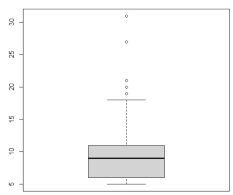

STAT 621: Theory of Statistics - Winter 2026
- [Chapter 0 Ponder Descriptive Statistics and R 1-8](#chapter-0-ponder-descriptive-statistics-and-r-1-8)
- [Chapter 3](#chapter-3)
  - [3.3 Gamma, Chi-square, and Beta Distributions 1-4, 18-19](#33-gamma-chi-square-and-beta-distributions-1-4-18-19)
    - [3.5.1 Bivariate Normal Distribution 1-2,7](#351-bivariate-normal-distribution-1-27)
  - [3.6 t and F Distributions 1-2, 4-5](#36-t-and-f-distributions-1-2-4-5)
- [Chapter 4](#chapter-4)
  - [4.1 Sampling and Statistics 1-4](#41-sampling-and-statistics-1-4)
  - [4.2 Confidence Intervals 1-2, 4-8, 15-18, 20, 22](#42-confidence-intervals-1-2-4-8-15-18-20-22)
  - [4.5 Introduction To Hypothesis Tests 2-4, 8, 10](#45-introduction-to-hypothesis-tests-2-4-8-10)
    - [4.6.1 p-Value 5-8](#461-p-value-5-8)
  - [4.7 Chi-Square Tests 4-7, 9](#47-chi-square-tests-4-7-9)
  - [4.9 Bootstrap Procedures 1, 4, 9, 13](#49-bootstrap-procedures-1-4-9-13)
- [Chapter 5](#chapter-5)
  - [5.3 Central Limit Theorem 1-3, 6-8](#53-central-limit-theorem-1-3-6-8)
- [Chapter 9](#chapter-9)
  - [9.2 One-Way ANOVA 3, 6-8](#92-one-way-anova-3-6-8)
  - [9.5 Two-Way ANOVA 6, 8, 10](#95-two-way-anova-6-8-10)
  - [9.6 Regression 2-3, 14](#96-regression-2-3-14)
- [Chapter 10](#chapter-10)
  - [10.2 Sample Median and the Sign Test 4](#102-sample-median-and-the-sign-test-4)
  - [10.3 Signed-Rank Wilcoxon](#103-signed-rank-wilcoxon)
- [Exams](#exams)
  - [Exam 1](#exam-1)
    - [Exam 1-1](#exam-1-1)
    - [Exam 1-2](#exam-1-2)
    - [Exam 1-3](#exam-1-3)
    - [Exam 1-4](#exam-1-4)
    - [Exam 1-5](#exam-1-5)
    - [Exam 1-6](#exam-1-6)
    - [Exam 1-7](#exam-1-7)
    - [Exam 1-8](#exam-1-8)
    - [Exam 1-9](#exam-1-9)
    - [Exam 1-10](#exam-1-10)


# Chapter 0 Ponder Descriptive Statistics and R 1-8 
# Chapter 3
## 3.3 Gamma, Chi-square, and Beta Distributions 1-4, 18-19 
### 3.5.1 Bivariate Normal Distribution 1-2,7 
## 3.6 t and F Distributions 1-2, 4-5 

# Chapter 4
## 4.1 Sampling and Statistics 1-4 
## 4.2 Confidence Intervals 1-2, 4-8, 15-18, 20, 22 
## 4.5 Introduction To Hypothesis Tests 2-4, 8, 10 
### 4.6.1 p-Value 5-8 
## 4.7 Chi-Square Tests 4-7, 9 
## 4.9 Bootstrap Procedures 1, 4, 9, 13 

# Chapter 5
## 5.3 Central Limit Theorem 1-3, 6-8 

# Chapter 9
## 9.2 One-Way ANOVA 3, 6-8 
## 9.5 Two-Way ANOVA 6, 8, 10 
## 9.6 Regression 2-3, 14 

# Chapter 10
## 10.2 Sample Median and the Sign Test 4 
## 10.3 Signed-Rank Wilcoxon

# Exams
## Exam 1
### Exam 1-1
(a) Compute the mean $\mu$ of $X$
$$M'(t) = \frac{d}{dt}(1 - 2t)^{-10} = -10(1 - 2t)^{-11}(-2) = 20(1 - 2t)^{-11}$$
$$\mu = M'(0) = 20(1 - 0)^{-11} = 20$$

(b) Compute the standard deviation $\sigma$ of $X$
$$M''(t) = \frac{d}{dt}[20(1 - 2t)^{-11}] = 20(-11)(1 - 2t)^{-12}(-2) = 440(1 - 2t)^{-12}$$$$E[X^2] = M''(0) = 440$$$$\text{Variance} (\sigma^2) = E[X^2] - (E[X])^2 = 440 - (20)^2 = 440 - 400 = 40$$$$\sigma = \sqrt{40}$$

(c) Use R to compute $P(X > 9)$

(d)
$$|X - \mu| < \sigma$$
$$-\sigma < X - \mu < \sigma$$
$$\mu - \sigma < X < \mu + \sigma$$


### Exam 1-2
Mean $\mu = \alpha\beta = 8$
Variance $\sigma^2 = \alpha\beta^2 = 16$

$$\frac{\sigma^2}{\mu} = \frac{\alpha\beta^2}{\alpha\beta} = \beta \implies \beta = \frac{16}{8} = 2$$
$$\alpha = \frac{\mu}{\beta} = \frac{8}{2} = 4$$

### Exam 1-3
Compute the value of the constant $c$ for the Beta distribution
PDF:$$f(x) = c x^2 (1-x)^8, \quad 0 < x < 1$$

Reasoning:For $f(x)$ to be a valid probability density function, the integral over its entire range must equal 1.
$$\int_{0}^{1} c x^2 (1-x)^8 \, dx = 1$$
$$c \int_{0}^{1} x^2 (1-x)^8 \, dx = 1$$

The integral part matches the definition of the Beta Function, $B(\alpha, \beta)$, which is defined as:
$$B(\alpha, \beta) = \int_{0}^{1} x^{\alpha-1} (1-x)^{\beta-1} \, dx$$

By comparing exponents:$x^2 \implies \alpha - 1 = 2 \implies \alpha = 3$
$(1-x)^8 \implies \beta - 1 = 8 \implies \beta = 9$

So, the integral is equal to $B(3, 9)$.
$$c \cdot B(3, 9) = 1 \implies c = \frac{1}{B(3, 9)}$$

The Beta function is related to the Gamma function (and factorials for integers) by:
$$B(\alpha, \beta) = \frac{\Gamma(\alpha)\Gamma(\beta)}{\Gamma(\alpha+\beta)}$$

Since $\alpha$ and $\beta$ are integers, $\Gamma(n) = (n-1)!$.

Substituting the values:
$$c = \frac{\Gamma(3+9)}{\Gamma(3)\Gamma(9)} = \frac{\Gamma(12)}{\Gamma(3)\Gamma(9)}$$

$$c = \frac{11!}{2! \cdot 8!}$$

Calculation:
$$c = \frac{11 \cdot 10 \cdot 9 \cdot 8!}{ (2 \cdot 1) \cdot 8!}$$
$$c = \frac{11 \cdot 10 \cdot 9}{2}$$
$$c = 11 \cdot 5 \cdot 9$$
$$c = 55 \cdot 9$$
$$c = 495$$
Answer:$$c = 495$$

### Exam 1-4
Problem: Show that the Maximum Likelihood Estimator (MLE) of $p$ for a Bernoulli population is $\hat{p} = \bar{X}$.

Likelihood FunctionFor a sample $X_1, \dots, X_n$ from a Bernoulli($p$) distribution, the probability mass function is $P(X_i = x_i) = p^{x_i}(1-p)^{1-x_i}$.

The likelihood function $L(p)$ is the product of these probabilities:
$$L(p) = \prod_{i=1}^{n} p^{x_i} (1-p)^{1-x_i}$$
$$L(p) = p^{\sum x_i} (1-p)^{\sum (1-x_i)}$$
$$L(p) = p^{\sum x_i} (1-p)^{n - \sum x_i}$$

2. Log-Likelihood FunctionIt is easier to maximize the natural logarithm of the likelihood function, $\ell(p) = \ln(L(p))$:$$\ell(p) = \left(\sum_{i=1}^n x_i\right) \ln(p) + \left(n - \sum_{i=1}^n x_i\right) \ln(1-p)$$

3. Differentiate and SolveTake the derivative with respect to $p$ and set it to 0 to find the maximum:
$$\frac{d\ell}{dp} = \frac{\sum x_i}{p} - \frac{n - \sum x_i}{1-p} = 0$$
Rearrange the terms:$$\frac{\sum x_i}{p} = \frac{n - \sum x_i}{1-p}$$
Cross-multiply:$$(1-p) \sum x_i = p \left(n - \sum x_i\right)$$
$$\sum x_i - p \sum x_i = np - p \sum x_i$$
Add $p \sum x_i$ to both sides:
$$\sum x_i = np$$
Solve for $p$:
$$\hat{p} = \frac{1}{n} \sum_{i=1}^n x_i$$
Since $\frac{1}{n} \sum X_i$ is the definition of the sample mean $\bar{X}$:$$\hat{p} = \bar{X}$$
Answer: The maximum likelihood estimator is $\hat{p} = \bar{X}$.

### Exam 1-5
Problem 5 SolutionGoal: Show that the sample variance $S^2$ is an unbiased estimator of the population variance $\sigma^2$.

This means we need to prove that the expected value $E[S^2] = \sigma^2$.

Definition:
$$S^2 = \frac{1}{n-1} \sum_{i=1}^n (X_i - \bar{X})^2$$
Step 1: Expand the summation term.We use the algebraic trick of adding and subtracting the population mean $\mu$:$$\sum_{i=1}^n (X_i - \bar{X})^2 = \sum_{i=1}^n [(X_i - \mu) - (\bar{X} - \mu)]^2$$

Expanding the square $(a-b)^2 = a^2 - 2ab + b^2$:
$$= \sum_{i=1}^n [(X_i - \mu)^2 - 2(X_i - \mu)(\bar{X} - \mu) + (\bar{X} - \mu)^2]$$
Distribute the summation:
$$= \sum_{i=1}^n (X_i - \mu)^2 - 2(\bar{X} - \mu)\sum_{i=1}^n (X_i - \mu) + \sum_{i=1}^n (\bar{X} - \mu)^2$$
Note that $\sum (X_i - \mu) = \sum X_i - n\mu = n\bar{X} - n\mu = n(\bar{X} - \mu)$.
Substituting this into the middle term:
$$= \sum (X_i - \mu)^2 - 2(\bar{X} - \mu)[n(\bar{X} - \mu)] + n(\bar{X} - \mu)^2$$
$$= \sum (X_i - \mu)^2 - 2n(\bar{X} - \mu)^2 + n(\bar{X} - \mu)^2$$
$$= \sum_{i=1}^n (X_i - \mu)^2 - n(\bar{X} - \mu)^2$$

Step 2: Apply the Expected Value operator.
$$E\left[ \sum (X_i - \bar{X})^2 \right] = E\left[ \sum (X_i - \mu)^2 \right] - E\left[ n(\bar{X} - \mu)^2 \right]$$
$$= \sum E[(X_i - \mu)^2] - n E[(\bar{X} - \mu)^2]$$

By definition of variance:$E[(X_i - \mu)^2] = \text{Var}(X) = \sigma^2$$E[(\bar{X} - \mu)^2] = \text{Var}(\bar{X}) = \frac{\sigma^2}{n}$

Substitute these back:
$$= \sum_{i=1}^n (\sigma^2) - n \left( \frac{\sigma^2}{n} \right)$$
$$= n\sigma^2 - \sigma^2$$
$$= (n-1)\sigma^2$$

Step 3: Final Calculation.
$$E[S^2] = E\left[ \frac{1}{n-1} \sum (X_i - \bar{X})^2 \right]$$
$$= \frac{1}{n-1} E\left[ \sum (X_i - \bar{X})^2 \right]$$
$$= \frac{1}{n-1} [(n-1)\sigma^2]$$
$$E[S^2] = \sigma^2$$
Conclusion: Since the expected value of $S^2$ equals the parameter $\sigma^2$, $S^2$ is an unbiased estimator.

### Exam 1-6
Calculate a 99% confidence interval for the mean.

1. Analyze the DataDataset: $\{12, 15, 8, 20, 15, 16, 17, 11, 14, 10\}$

Sample size ($n$): 10
Sample Mean ($\bar{x}$):
$$\bar{x} = \frac{12+15+8+20+15+16+17+11+14+10}{10} = \frac{138}{10} = 13.8$$

Sample Standard Deviation ($s$):
First, calculate the Sum of Squared Differences (SS):
$SS = (12-13.8)^2 + (15-13.8)^2 + ... + (10-13.8)^2$
$SS = (-1.8)^2 + (1.2)^2 + (-5.8)^2 + (6.2)^2 + (1.2)^2 + (2.2)^2 + (3.2)^2 + (-2.8)^2 + (0.2)^2 + (-3.8)^2$
$SS = 3.24 + 1.44 + 33.64 + 38.44 + 1.44 + 4.84 + 10.24 + 7.84 + 0.04 + 14.44 = 115.6$

Sample Variance ($s^2$) = $\frac{SS}{n-1} = \frac{115.6}{9} \approx 12.844$

Sample Std Dev ($s$) = $\sqrt{12.844} \approx 3.584$2. Determine Critical ValueSince $n < 30$ and population variance is unknown, use the t-distribution.Degrees of freedom ($df$): $10 - 1 = 9$
Confidence Level: 99% $\rightarrow \alpha = 0.01 \rightarrow \alpha/2 = 0.005$
Critical Value ($t_{0.005, 9}$): From t-table, $t \approx 3.250$3. Calculate Interval
$$\bar{x} \pm t \left( \frac{s}{\sqrt{n}} \right)$$
$$13.8 \pm 3.250 \left( \frac{3.584}{\sqrt{10}} \right)$$
$$13.8 \pm 3.250 (1.133)$$$$13.8 \pm 3.68$$
Lower Bound: $13.8 - 3.68 = 10.12$
Upper Bound: $13.8 + 3.68 = 17.48$Answer: (10.12, 17.48)

### Exam 1-7
1. Statistics$n = 500$
$x = 212$
$\hat{p} = \frac{212}{500} = 0.424$
$\hat{q} = 1 - 0.424 = 0.576$

2. Critical ValueFor 95% confidence, $z_{\alpha/2} = 1.96$.

3. Margin of Error ($E$)
$$E = z \sqrt{\frac{\hat{p}\hat{q}}{n}} = 1.96 \sqrt{\frac{0.424 \times 0.576}{500}}$$
$$E = 1.96 \sqrt{0.000488} \approx 1.96(0.0221) \approx 0.043$$

4. Interval
$$\hat{p} \pm E \implies 0.424 \pm 0.043$$
Lower: $0.381$Upper: $0.467$
Answer
Part A: (0.381, 0.467) or (38.1%, 46.7%)
Part B: Sample Size Calculation
Goal: Margin of Error $E \le 0.04$ (at most 4%).
Formula: $n = \hat{p}(1-\hat{p}) \left( \frac{z}{E} \right)^2$
Using the estimate $\hat{p} = 0.424$ from the pilot study:
$$n = 0.424(0.576) \left( \frac{1.96}{0.04} \right)^2$$
$$n = 0.244224 \times (49)^2$$
$$n = 0.244224 \times 2401 \approx 586.38$$
Since we cannot survey a fraction of a person, we round up.Answer Part B: 587 voters

### Exam 1-8
Calculate a 90% confidence interval for the standard deviation.
1. Statistics
Using the same sample from Problem 6:$n = 10$, $df = 9$Sum of Squares ($SS$) = $(n-1)s^2 = 115.6$

2. Critical Values (Chi-Square)We need $\chi^2_{lower}$ and $\chi^2_{upper}$ for a 90% confidence interval.
$\alpha = 0.10$. Split into tails: $0.05$ and $0.95$.$\chi^2_{0.05, 9}$ (Right tail area 0.05): 16.919$\chi^2_{0.95, 9}$ (Right tail area 0.95): 3.3253. Interval for Variance ($\sigma^2$)
$$\frac{(n-1)s^2}{\chi^2_{upper}} < \sigma^2 < \frac{(n-1)s^2}{\chi^2_{lower}}$$
$$\frac{115.6}{16.919} < \sigma^2 < \frac{115.6}{3.325}$$
$$6.83 < \sigma^2 < 34.77$$
4. Interval for Standard Deviation ($\sigma$)Take the square root of the variance bounds:
$$\sqrt{6.83} < \sigma < \sqrt{34.77}$$
$$2.61 < \sigma < 5.90$$
Answer: (2.61, 5.90)

### Exam 1-9
95% CI for Difference in Means (Equal Variance).
Pop 1: $n_1=15, \bar{x}_1=8.2, s_1=1.25$
Pop 2: $n_2=12, \bar{x}_2=5.7, s_2=1.10$
Pooled Variance ($s_p^2$):
$$s_p^2 = \frac{(14)(1.25)^2 + (11)(1.10)^2}{15+12-2} = \frac{21.875 + 13.31}{25} = 1.4074$$
$$s_p = \sqrt{1.4074} \approx 1.186$$

Standard Error:
$$SE = 1.186 \sqrt{\frac{1}{15} + \frac{1}{12}} \approx 1.186(0.387) \approx 0.459$$
Critical Value: $t_{0.025, 25} \approx 2.060$Calculation:
$$(\bar{x}_1 - \bar{x}_2) \pm t \cdot SE \Rightarrow (8.2 - 5.7) \pm 2.060(0.459) \Rightarrow 2.5 \pm 0.946$$
Interval: $(1.55, 3.45)$

### Exam 1-10

(a) Data: Number of scored goals by the top 47 goal scorers in Spanish LaLiga season 2024-2025. Link of the data: https://www.espn.com/soccer/stats/_/league/ESP.1/season/2024.

5, 5, 5, 5, 5, 6, 6, 6, 6, 6, 6, 6, 6, 7, 7, 7, 7, 8, 8, 8, 8, 9, 9, 9, 9, 9, 10, 10, 10, 10, 10, 11, 11, 11, 11, 11, 11, 12, 13, 15, 17, 18, 19, 20, 21, 27, 31.

(b) Sample mean and sd
```R
> goals <- c(5, 5, 5, 5, 5, 6, 6, 6, 6, 6, 6, 6, 6, 7, 7, 7, 7, 8, 8, 8, 8, 9, 9, 9, 9, 9, 10, 10, 10, 10, 10, 11, 11, 11, 11, 11, 11, 12, 13, 15, 17, 18, 19, 20, 21, 27, 31)
> mean(goals)
[1] 10.3617
> sd(goals)
[1] 5.696778
```

(c) Box plot  


(d) Potential outliers:
$Y_1=5$  
$Q_1=Y_{.25\times 48}=Y_{12}=6$  
$Q_2=Y_{24}=9$  
$Q_3=Y_{.75\times 48}=Y_{36}=11$  
$Y_47=31$  

$h=1.5(Q_3-Q_1)=1.5(11-6)=7.5$  
$LF=Q_1-h=6-7.5=-1.5$  
$UF=Q_3+h=11+7.5=18.5$  

Outlier values are: 19, 20, 21, 27, 31.

(e) Histogram  


(f) Proportion of values within one sample standard deviation.
Range of values: $(\bar{x}-s,\bar{x}+s)=(10.4-5.7,10.4+5.7)=(4.7,16.1)$

There are 7 values outside this range: 17, 18, 19, 20, 21, 27, 31. Proportion of values within the range = $40/47=0.85$.