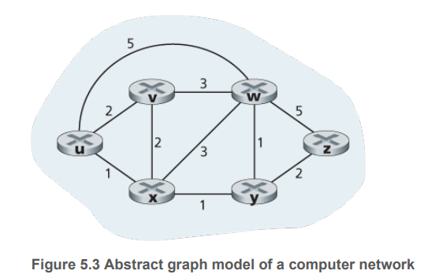

# Table of Contents
- [Table of Contents](#table-of-contents)
  - [Chapter 1: Computer Networks and the Internet](#chapter-1-computer-networks-and-the-internet)
    - [1.5 Protocol Layers and Their Service Models](#15-protocol-layers-and-their-service-models)
      - [The Application Layer](#the-application-layer)
      - [Transport Layer](#transport-layer)
      - [Network layer](#network-layer)
      - [Link Layer](#link-layer)
      - [Physical Layer](#physical-layer)
      - [Lecture](#lecture)
  - [Chapter 2: Application Layer](#chapter-2-application-layer)
    - [2.1 Principles of Network Application](#21-principles-of-network-application)
    - [2.2 The Web and HTTP](#22-the-web-and-http)
      - [2.2.1 Overview of HTTP](#221-overview-of-http)
      - [2.2.2 Non-Persistent and Persistent Connections](#222-non-persistent-and-persistent-connections)
      - [2.2.3 HTTP Message Format](#223-http-message-format)
      - [2.2.4 User-Server Interaction: Cookies](#224-user-server-interaction-cookies)
      - [2.2.5 Web Caching](#225-web-caching)
    - [2.3 Electronic Mail in the Internet](#23-electronic-mail-in-the-internet)
    - [2.4 DNS--The Internet's Directory Service](#24-dns--the-internets-directory-service)
    - [2.5 Peer-to-Peer Applications](#25-peer-to-peer-applications)
    - [2.6 Video Streaming and Content Distribution Networks](#26-video-streaming-and-content-distribution-networks)
    - [2.7 Socket Programming: Creating Network Applications](#27-socket-programming-creating-network-applications)
  - [Chapter 3: Transport Layer](#chapter-3-transport-layer)
    - [Dr. Tahat's Notes](#dr-tahats-notes)
    - [3.1 Introduction and Transport-Layer Services](#31-introduction-and-transport-layer-services)
    - [3.2 Multiplexing and Demultiplexing](#32-multiplexing-and-demultiplexing)
    - [3.3 Connectionless Transport: UDP](#33-connectionless-transport-udp)
    - [3.4 Principles of Reliable Data Transfer](#34-principles-of-reliable-data-transfer)
    - [3.5 Connection-Oriented Transport: TCP](#35-connection-oriented-transport-tcp)
    - [3.6 Principles of Congestion Control](#36-principles-of-congestion-control)
    - [3.7 TCP Congestion Control](#37-tcp-congestion-control)
    - [Wireshark](#wireshark)
    - [Project 1](#project-1)
  - [Chapter 4: The Network Layer: Data Plane](#chapter-4-the-network-layer-data-plane)
    - [Dr. Tahat's Lecture](#dr-tahats-lecture)
    - [4.1 Overview of Network Layer](#41-overview-of-network-layer)
      - [4.1.1 Forwarding and Routing: the Network Data and Control Planes](#411-forwarding-and-routing-the-network-data-and-control-planes)
        - [Control Plane: Traditional Approach](#control-plane-traditional-approach)
        - [Control Plane: SDN Approach](#control-plane-sdn-approach)
      - [4.1.2 Network Service Models](#412-network-service-models)
    - [4.2 What's Inside a Router](#42-whats-inside-a-router)
      - [4.2.1 Input Port Processing and Destination-Based Forwarding](#421-input-port-processing-and-destination-based-forwarding)
      - [4.2.2 Switching](#422-switching)
      - [4.2.3 Output Port Processing](#423-output-port-processing)
      - [4.2.4 Where Does Queuing Occur?](#424-where-does-queuing-occur)
      - [4.2.5 Packet Scheduling](#425-packet-scheduling)
    - [4.3 The Internet Protocol (IP): IPv4, Addressing, IPv6, and More](#43-the-internet-protocol-ip-ipv4-addressing-ipv6-and-more)
      - [4.3.1 IPv4 Datagram Format](#431-ipv4-datagram-format)
      - [4.3.2 IPv4 Datagram Fragmentation](#432-ipv4-datagram-fragmentation)
      - [4.3.3 IPv4 Addressing](#433-ipv4-addressing)
      - [4.3.4 Network Address Translation (NAT)](#434-network-address-translation-nat)
      - [4.3.5 IPv6](#435-ipv6)
    - [4.4 Generalized Forwarding and SDN](#44-generalized-forwarding-and-sdn)
      - [4.4.1 Match](#441-match)
      - [4.4.2 Action](#442-action)
      - [4.4.3 OpenFlow Examples of Match-plus-action in Action](#443-openflow-examples-of-match-plus-action-in-action)
  - [Chapter 5: The Network Layer: Control Plane](#chapter-5-the-network-layer-control-plane)
    - [5.1 Introduction](#51-introduction)
    - [5.2 Routing Algorithms](#52-routing-algorithms)
      - [5.2.1 The Link-State (LS) Routing Algorithm](#521-the-link-state-ls-routing-algorithm)
      - [5.2.2 The Distance-Vector (DV) Routing Algorithm](#522-the-distance-vector-dv-routing-algorithm)
    - [5.3 Intra-AS Routing in the Internet: OSPF](#53-intra-as-routing-in-the-internet-ospf)
    - [5.4 Routing Among the ISPs: BGP](#54-routing-among-the-isps-bgp)
      - [5.4.1 The Role of BGP](#541-the-role-of-bgp)
      - [5.4.2 Advertising BGP Route Information](#542-advertising-bgp-route-information)
      - [5.4.3 Determining the Best Routes](#543-determining-the-best-routes)
      - [5.4.4 IP-Anycast](#544-ip-anycast)
      - [5.4.5 Routing Policy](#545-routing-policy)
      - [5.4.6 Putting the Pieces Together: Obtaining Internet Presence](#546-putting-the-pieces-together-obtaining-internet-presence)
    - [5.5 The SDN Control Plane](#55-the-sdn-control-plane)
      - [5.5.1 The SDN Control Plane: SDN Controller and SDN Control Applications](#551-the-sdn-control-plane-sdn-controller-and-sdn-control-applications)
      - [5.5.2 OpenFlow Protocol](#552-openflow-protocol)
      - [5.5.3 Data and Control Plane Interaction: An Example](#553-data-and-control-plane-interaction-an-example)
      - [5.5.4 SDN: Past and Future](#554-sdn-past-and-future)
    - [5.6 ICMP: The Internet Control Message Protocol](#56-icmp-the-internet-control-message-protocol)
    - [5.7 Network Management and SNMP](#57-network-management-and-snmp)
      - [5.7.1 The Network Management Framework](#571-the-network-management-framework)
      - [5.7.2 The Simple Network Management Protocol (SNMP)](#572-the-simple-network-management-protocol-snmp)
    - [5.8 Summary](#58-summary)
  - [Chapter 6: The Link Layer and LANs](#chapter-6-the-link-layer-and-lans)
    - [6.1 Introduction to the Link Layer](#61-introduction-to-the-link-layer)
      - [6.1.1 The Services Provided by the Link Layer](#611-the-services-provided-by-the-link-layer)
      - [6.1.2 Where Is the Link Layer Implemented?](#612-where-is-the-link-layer-implemented)
    - [6.2 Error-Detection and -Correction Techniques](#62-error-detection-and--correction-techniques)
      - [6.2.1 Parity Checks](#621-parity-checks)
      - [6.2.2 Checksumming Methods](#622-checksumming-methods)
      - [6.2.3 Cyclic Redundancy Check (CRC)](#623-cyclic-redundancy-check-crc)
    - [6.3 Multiple Access Links and Protocols](#63-multiple-access-links-and-protocols)
      - [6.3.1 Channel Partitioning Protocols](#631-channel-partitioning-protocols)
      - [6.3.2 Random Access Protocols](#632-random-access-protocols)
      - [6.3.3 Taking-Turns Protocols](#633-taking-turns-protocols)
      - [6.3.4 DOCSIS: The Link-Layer Protocol for Cable Internet Access](#634-docsis-the-link-layer-protocol-for-cable-internet-access)
    - [6.4 Switched Local Area Networks](#64-switched-local-area-networks)
      - [6.4.1 Link-Layer Addressing and ARP](#641-link-layer-addressing-and-arp)
      - [6.4.2 Ethernet](#642-ethernet)
      - [6.4.3 Link-Layer Switches](#643-link-layer-switches)
      - [6.4.4 Virtual Local Area Networks (VLANs)](#644-virtual-local-area-networks-vlans)
    - [6.5 Link Virtualization: A Network as a Link Layer](#65-link-virtualization-a-network-as-a-link-layer)
      - [6.5.1 Multiprotocol Label Switching (MPLS)](#651-multiprotocol-label-switching-mpls)
    - [6.6 Data Center Networking](#66-data-center-networking)
    - [6.7 Retrospective: A Day in the Life of a Web Page Request](#67-retrospective-a-day-in-the-life-of-a-web-page-request)
      - [6.7.1 Getting Started: DHCP, UDP, IP, and Ethernet](#671-getting-started-dhcp-udp-ip-and-ethernet)
      - [6.7.2 Still Getting Started: DNS and ARP](#672-still-getting-started-dns-and-arp)
      - [6.7.3 Still Getting Started: Intra-Domain Routing to the DNS Server](#673-still-getting-started-intra-domain-routing-to-the-dns-server)
      - [6.7.4 Web Client-Server Interaction: TCP and HTTP](#674-web-client-server-interaction-tcp-and-http)
    - [6.8 Summary](#68-summary)
  - [Chapter 7: Wireless and Mobile Networks](#chapter-7-wireless-and-mobile-networks)
    - [7.1 Introduction](#71-introduction)
    - [7.2 Wireless Links and Network Characteristics](#72-wireless-links-and-network-characteristics)
      - [7.2.1 CDMA](#721-cdma)
    - [7.3 WiFi: 802.11 Wireless LANs](#73-wifi-80211-wireless-lans)
      - [7.3.1 The 802.11 Architecture](#731-the-80211-architecture)
      - [7.3.2 The 802.11 MAC Protocol](#732-the-80211-mac-protocol)
      - [7.3.3 The IEEE 802.11 Frame](#733-the-ieee-80211-frame)
      - [7.3.4 Mobility in the Same IP Subnet](#734-mobility-in-the-same-ip-subnet)
      - [7.3.5 Advanced Features in 802.11](#735-advanced-features-in-80211)
      - [7.3.6 Personal Area Networks: Bluetooth and Zigbee](#736-personal-area-networks-bluetooth-and-zigbee)
    - [7.4 Cellular Internet Access](#74-cellular-internet-access)
      - [7.4.1 An Overview of Cellular Network Architecture](#741-an-overview-of-cellular-network-architecture)
      - [7.4.2 3G Cellular Data Networks: Extending the Internet to Cellular Subscribers](#742-3g-cellular-data-networks-extending-the-internet-to-cellular-subscribers)
      - [7.4.3 On to 4G: LTE](#743-on-to-4g-lte)
    - [7.5 Mobility Management: Principles](#75-mobility-management-principles)
      - [7.5.1 Addressing](#751-addressing)
      - [7.5.2 Routing to a Mobile Node](#752-routing-to-a-mobile-node)
    - [7.6 Mobile IP](#76-mobile-ip)
    - [7.7 Managing Mobility in Cellular Networks](#77-managing-mobility-in-cellular-networks)
      - [7.7.1 Routing Calls to a Mobile User](#771-routing-calls-to-a-mobile-user)
      - [7.7.2 Handoffs in GSM](#772-handoffs-in-gsm)
    - [7.8 Wireless and Mobility: Impact on Higher-Layer Protocols](#78-wireless-and-mobility-impact-on-higher-layer-protocols)
    - [7.9 Summary](#79-summary)
  - [Chapter 8: Security in Computer Networks](#chapter-8-security-in-computer-networks)
    - [8.1 What Is Network Security?](#81-what-is-network-security)
    - [8.2 Principles of Cryptography](#82-principles-of-cryptography)
      - [8.2.1 Symmetric Key Cryptography](#821-symmetric-key-cryptography)
      - [8.2.2 Public Key Encryption](#822-public-key-encryption)
    - [8.3 Message Integrity and Digital Signatures](#83-message-integrity-and-digital-signatures)
      - [8.3.1 Cryptographic Hash Functions](#831-cryptographic-hash-functions)
      - [8.3.2 Message Authentication Code](#832-message-authentication-code)
      - [8.3.3 Digital Signatures](#833-digital-signatures)
    - [8.4 End-Point Authentication](#84-end-point-authentication)
      - [8.4.1 Authentication Protocol ap1.0](#841-authentication-protocol-ap10)
      - [8.4.2 Authentication Protocol ap2.0](#842-authentication-protocol-ap20)
      - [8.4.3 Authentication Protocol ap3.0](#843-authentication-protocol-ap30)
      - [8.4.4 Authentication Protocol ap3.1](#844-authentication-protocol-ap31)
      - [8.4.5 Authentication Protocol ap4.0](#845-authentication-protocol-ap40)
    - [8.5 Securing E-Mail](#85-securing-e-mail)
      - [8.5.1 Secure E-Mail](#851-secure-e-mail)
      - [8.5.2 PGP](#852-pgp)
    - [8.6 Securing TCP Connections: SSL](#86-securing-tcp-connections-ssl)
      - [8.6.1 The Big Picture](#861-the-big-picture)
      - [8.6.2 A More Complete Picture](#862-a-more-complete-picture)
    - [8.7 Network-Layer Security: IPsec and Virtual Private Networks](#87-network-layer-security-ipsec-and-virtual-private-networks)
      - [8.7.1 IPsec and Virtual Private Networks (VPNs)](#871-ipsec-and-virtual-private-networks-vpns)
      - [8.7.2 The AH and ESP Protocols](#872-the-ah-and-esp-protocols)
      - [8.7.3 Security Associations](#873-security-associations)
      - [8.7.4 The IPsec Datagram](#874-the-ipsec-datagram)
      - [8.7.5 IKE: Key Management in IPsec](#875-ike-key-management-in-ipsec)
    - [8.8 Securing Wireless LANs](#88-securing-wireless-lans)
      - [8.8.1 Wired Equivalent Privacy (WEP)](#881-wired-equivalent-privacy-wep)
      - [8.8.2 IEEE 802.11i](#882-ieee-80211i)
    - [8.9 Operational Security: Firewalls and Intrusion Detection Systems](#89-operational-security-firewalls-and-intrusion-detection-systems)
      - [8.9.1 Firewalls](#891-firewalls)
      - [8.9.2 Intrusion Detection Systems](#892-intrusion-detection-systems)
    - [8.10 Summary](#810-summary)
- [Labs](#labs)
  - [Lab 1: spot delay using wireshark](#lab-1-spot-delay-using-wireshark)
    - [Dr. Tahat Session](#dr-tahat-session)
  - [Lab 2](#lab-2)
  - [Lab 3](#lab-3)
  - [Lab 4](#lab-4)
  - [Lab 5](#lab-5)
- [Projects](#projects)
  - [Project 1](#project-1-1)
  - [Project 2](#project-2)

## Chapter 1: Computer Networks and the Internet

### 1.5 Protocol Layers and Their Service Models
#### The Application Layer
is where network applications and their application-layer protocols reside.
Protocols:
- HTTP (which provides for Web
document request and transfer),
- SMTP (which provides for the transfer of e-mail messages),
- FTP (which provides for the transfer of files between two end systems).
- DNS (URL to 32-bit network address)

End systems use application-layer protocol to distribute packets of information called '**message**'.

#### Transport Layer
Transports application-layer messages between application endpoints.

Two transport protocols:
- **TCP**: reliable
  - provides a connection-oriented service to its applications.
  - This service includes guaranteed delivery of application-layer messages to the destination, flow and congestion control, etc.
- **UDP**: speed
  - The UDP protocol provides a connectionless service to its applications. This is a no-frills service that provides no reliability, no flow control, and no congestion control.

A transport-layer packet is a **segment**.

#### Network layer
responsible for moving network-layer packets known as **datagrams** from one host to another.

Transport-layer protocol in a source host passes a transport-layer segment and a destination address to the network layer. The network layer then provides the service of delivering the segment to the transport layer in the destination host.

Protocol:
- IP - defines the fields in the datagram as well as how the end systems and routers act on these fields. There is only one IP protocol, and all Internet components that have a network layer must run the IP protocol.

- Routing protocols - determine the routes that datagrams take between sources and destinations. The Internet has many routing protocols.

#### Link Layer
Routes a datagram through a series of routers between the source and destination.
At each node, the network layer passes the datagram down to the link layer, which delivers the datagram to the next node's network layer.

Services:
- reliable delivery: (different from TCP - one end system to another)

Protocols:
Ethernet
WiFi
cable access network’s DOCSIS protocol.

A datagram may be handled by different link-layer protocols at different links along its route.

Link-layer packets are **frames**.

#### Physical Layer
To move the individual bits within the frame from one node to the next.

Protocols: 
- depends on link, and actual transmission medium of the link (twisted-pair copper wire, single-mode fiber optics).
In each case, a bit is moved across the link in a different way.

#### Lecture
Down the stack - encapsulation, down the stack - decapsulation.

**Application layer**
- PDU **messages** (binary data, interpreted using file extensions).
- Protocols: running proccess follows **HTTP, HTTPS, DNS, SMTP, FTP**, etc. protocols.

**Transport layer**
- process-process logical connection
- PDU - **segments**
  - segmented data-efficiency,
  - multiplexing--multiple communication
- adds source and destination port address (process-process)
- protocol: **TCP** (reliable) or **UDP** (speed).

**Network layer**
- host-host logical connection
- PDU - **datagrams**
- adds source and destination host address (IP address).
- protocol: **IP**

**Link Layer**
- node to node logical connection
- PDU - **frames**.
- protocols: Ethernet, WiFi, etc.
- source and destination link address

**Physical Layer**
- physical connection.
- convert bits into signals.

**OSI Model**:
- Application
  - Application
  - Presentation: encryption
  - Session: establish, maintain and terminate communication session

## Chapter 2: Application Layer
### 2.1 Principles of Network Application

**Process communicating**
Program running within a host
- client process: initiates communication
- server process: waits to be contacted

### 2.2 The Web and HTTP
#### 2.2.1 Overview of HTTP

#### 2.2.2 Non-Persistent and Persistent Connections

#### 2.2.3 HTTP Message Format
**Format:**
Method: GET URL Protocol
Header: accepted content, language, compression, character set, persistent connection
Body

**Other HTTP request messages**:
- GET: (no body in request) (body in response).
  - Example: retrieve the current weather for a specific city.
- POST: (body in request that contains data) – creates new resource in client.
  - Example: Add weather data about a new city.
- HEAD: (no body in request) (no body in response)
- PUT: (body in request) – create or modify existing resource in a URL.
  - Example: update all weather data about a specific city.

**HTTP response message**:
- Status line: status code and phrase
- Header: Contains info of the content, connection.
- Body

**HTTP response status codes**: 200 OK and 404 Not Found

#### 2.2.4 User-Server Interaction: Cookies
HTTP GET/response interaction is **stateless**: server doesn’t sore information about previous client requests.

**Maintaining user/server state**: cookies
1. When a server wants to track a user, it includes a special header in HTTP response.
2. Client browser will keep a cookie (including sessionID) file.
3. Future request message headers will include the sessionID.
4. Server backend database will keep user info.

#### 2.2.5 Web Caching
Browser sends all HTTP requests to cache
- If object in cache: cache returns object to client
- Else cache requests object from origin server, caches received object, then returns object to client

Cache: both client and server
Benefits:
- Closer to user so faster response
- Reduce outgoing traffic

### 2.3 Electronic Mail in the Internet

### 2.4 DNS--The Internet's Directory Service
Network layer transport datagrams from host to host using 32-bit IP-address. But we use easy to remember 'names'.

**Domain Name System**
Application-layer protocol: hosts and name servers (distributed database) communicate to resolve address-name translation.

**DNS Service**
- Hostname to IP address translation -> initiate TCP connection.
- A host with complicated hostname or mail server can have one or more alias names.
- Load distribution: busy sites have multiple servers, their cname is associated with a set of IP addresses. DNS rotation of the set with each response distributes the load among the servers.

Why not centralized DNS
- Single point of failure
- traffic
- distance
- scale

**Distributed, hierarchical DB**: root name server > Top-level domain server (.com) > Authoritative DNS server (amazon.com) > IP address.
Local DNS name servers: ISP

Iterated query: replies with name of server to contact.
Recursive query: contacted server resolves name.

**Caching**: TDL mapping in local name servers for TTL time.

**DNS records**
DB storing resource records (RR).
Format
  - name, 
  - value, 
  - type
    - A-IP,
    - CNAME-real name,
    - NS-domain,
    - MX-mailserver
  - ttl

**DNS protocol messages**
- 12 byte header
  - 2 byte identifier
  - flags
    - 1 bit query/reply
    - 1 bit autoritative server
    - 1 bit recursion desired
    - ...
  - Quesion info: queried name, type
  - Answer: type, value, TTL - single or multiple.

**Inserting records into DNS**
- DNS registrar inserts NS, A RRs into TLD server: (networkutopia.com, dns1.networkutopia.com, NS)
(dns1.networkutopia.com, 212.212.212.1, A)
- Create autoritative server locally with IP

### 2.5 Peer-to-Peer Applications

### 2.6 Video Streaming and Content Distribution Networks

### 2.7 Socket Programming: Creating Network Applications
Door between application processes  and end-end-transport protocol.

Two socket for two transport service:
- TCP - reliable
- UDP - fast

**Socket programming with TCP**
Client
- contacts server
  - creates TCP socket
  - specifies server IP, port number of process
- establish connection

Server
- creates new socket for server process to communicate with the client

- Sender attaches destination IP with each packet, extracted by receiver.
- transmissed data may be lost or out of order.

## Chapter 3: Transport Layer

### Dr. Tahat's Notes
DNS and Socket on Friday.

**Transport Layer roadmap:**
- Transport-layer services
- Multiplexing and demultiplexing
- Connection-oriented transport: TCP
- TCP congestion control

**Transport-layer services:** logical communication (as if the connection is direct) between processes
- segment message

**Transport layer vs Network layer:** process vs host connection - a host can have many processes running at the same time - web page, email, etc.

**TCP vs UDP services:**
- in order delivery
- TCP flow control - not too much too fast
- congestion control
...

**Multiplexing and demultiplexing**
2 slides - figure of apache-netflix-firefox - multiplexing: seding down to clients, 

**Connection-oriented transport - TCP:**
seq #, ack #, CWND (congestion window size), RWND (remaining buffer)
Checksum: to check if the packet is corrupted or not
MSS = 1460

Segmenting the message - sequence number is the first bit

**TCP**:
point-to-point, reliable, full duplex, cumulative ACKs, pipelining, connection-oriented, flow controlled.

**TCP segment structure**

acknowledgement number - the next expected sequence number.

**TCP sequence numbers, ACKs** - sequence numbers are byte stream number

**TCP sequence numbers, ACKs **- figure animation between Host A and B.

**TCP round trip time, timeout X 3**:
slide 1 - RTT
slide 2 - estimatedRTT equation
slide 3 - timeout internval equation

**TCP Sender**: 

**TCP Receiver:A CK generation**
slide - event at receiver vs TCP receiver action
if 3 duplications from receiver indicate packet loss and retransmit the packet.

**TCP: retransmission scenario**
ack=seq+data byte - indicates i'm good upto seq+data-1 - send me seq+data next
no need to send ack for 100 again - good upto 120.

slide 2: even though 100 ack was lost, 120 ack means we're OK

**TCP fast retransmit**:
4 ack=100 - 3 segments received after a missing segment - retransmit.

Show example of TCP conversation in wireshark.

try for highest throughput untill we start to have packet loss - then slow down again, and try again ...

**TCP flow control**
Receiver will control the amount of data sent from the sender - rwnd and cwnd.

Wireshark example: window, calculated window size

**TCP connection management**
In-flight data will should be less than or equal to min(cwnd, rwnd)
cwnd is not advertised, for the whole network.

Agreed parameters: rwnd

Sender is going to say the socket buffer limit

rwnd: 65535 (2^16)
Options>MSS: 1460
Options>WindowScale: multiply by 64 vs 4

Client - Window: 4096 X window scaling factor: 64 = calculated window size: 262144

Server - Window: 53238 X window scaling factor: 4 = calculated window size: 212952

**TCP 3-way handshake**
Last step - establish conneciton.

**Closing a TCP conneciton**:
FIN

**TCP congestion control**
Congestion: too many senders sending too fast.

cwnd: amount of unacked packet that can be sent

AIMD: 

Loss detection:
- 3 duplicate packets - reduce
- timeout (probably more congested) - reduce more

ssthrehold = loss point/2
- increment by 1 after the thres

Tahoe (1 scenario: slow start) vs Reno (2 scenario: slow start and congestion avoidance)

TCP Cubic: improvement

Project:
Generate a CSV file:
Figure why the drop was selected (timeout vs 3 duplicates). Then implement Reno and Tahoe - find 

### 3.1 Introduction and Transport-Layer Services

- Provide logical communication (complex route in reality) between application processes (e.g., client and server) running on different hosts.
- implemented in end systems

App-layer packet **messages**
-> breakdown and add header
-> Transport-layer packet **segments**
-> Network-layer packet **datagram** - routers interact only with Network-layer fields of datagram
-> receiver-end Network-layer passes segment to Transport-layer
-> receiver-end Transport-layer compiles message from segments and passes to application layer.

Transport layer provides logical-communication between processes, network layer provides logical-communication between hosts.

Analogy:
12 kids in Ann’s house sending letters to 12 kids in Bill’s house:
hosts = houses
processes = kids
app messages = letters in envelopes
transport protocol = Ann and Bill who demux to in-house siblings
network-layer protocol = postal service

### 3.2 Multiplexing and Demultiplexing
Transport layer receives/delivers data from/to sockets. Each socket has an unique identifier - each segment has fields to identify right socket.

**Multiplexing**
  - gathering data chunks from different sockets
  - encapsulating each with header info (source-dest. IP addresses, source-dest. port numbers) to create segments,
  - passing segments to network layer.
**Demultiplexing**
  - delivering data  in a segment to the correct socket using header info (source-dest. IP addresses, source-dest. port numbers).

This extends host-to-host delivery service provided by network layer to a process-to-process delivery service by applications on a host.

### 3.3 Connectionless Transport: UDP

### 3.4 Principles of Reliable Data Transfer

rdt_send()
udt_send()
rdt_rcv()
deliver_data()

Finite State Machines: event/actions

rdt1.0: reliable data transfer over a reliable channel
- sender: rdt_send(data)/(udt_send(packet=make_pkt))
- receiver: rdt_rcv(packet)/(deliver_data(extract(packet,data)))

rdt2.0:channel with bit errors
checksum to detect bit error
- ACKs: pkt received OK
- NAKs: pkt had errors -> retransmit

sender: 
rdt_send(data):
    sndpkt=make_pkt(data,checksum)
    udt_send(sndpkt)
- if rdt_rcv(rcvpkt) && isNAK(rcvpkt):
  - udt_send(sndpkt)
- elif rdt_rcv(rcvpkt) && isACK(rcvpkt):
  - next

receiver:
- if rdt_rcv(rcvpkt) && corrupt(rcvpkt):
  - udt_send(NAK)
- elif rdt_rcv(rcvpkt) && notcorrupt(rcvpkt):
  - extract(rcvpkt, data)
  - deliver_data(data)
  - udt_send(ACK)

If ACK/NAK is corrupted -> retransmit current pkt with seq+1

Receiver discards duplicate pkt

rdt_send(data):
    sndpkt=make_pkt(0,data,checksum)
    udt_send(sndpkt)
- if rdt_rcv(rcvpkt) && corrupt(rcvpkt) || isNAK(rcvpkt):
  - udt_send(sndpkt):
    sndpkt=make_pkt(1,data,checksum)
    udt_send(sndpkt)
- elif rdt_rcv(rcvpkt) && notcorrupt(rcvpkt) && isACK(rcvpkt):
  - next
- elif 

rdt3.0:channels with errors and loss

sender waits "reasonable" amount of time for ACK
- retransmits if no ACK received

### 3.5 Connection-Oriented Transport: TCP
- Each TCP conversation will have one sender and one receiver.
- reliable, in order byte stream
- full duplex data
- TCP is "connection-oriented" - two processes must first "handshake" to establish connection before exchanging data.
- upcoming: cumulative ACKs, pipelining, flow controlled

**TCP segment structure**
- source and dest. port #: based on process
- sequence number: counting bytes of data into *bytestream*
  - Bytestream: like serial number of first byte being sent
- ACK number and flag: sequence of next expected byte
- application data (1460 bytes)
- checksum: error detection - calculated at both ends
- options: variable
- length (depends on options)
- RST, SYN, FIN flags: restart, start, finish.
- receive window: remaining receiver buffer
- C, E: congestion notification
- Urgent data pointer

**TCP sequence numbers, ACKs**
- seq #: serial of the first byte to send
- ack #:
  - seq # of next expected byte (ack # - 1 already received)
  - cumulative ack: acknowledge the last serial
- out of order segments - typically stored

seq 42 - 42th byte received
ack 43 - 43rd byte expected next

**TCP round trip timeout**
Timeout function: retransmit if ack doesn't arrive within a specific time.
Timeout value: longer than round trip time (RTT).

Current estimatedRTT = 200
Latest SampleRTT = 260
EstimatedRTT = 0.875 * 200 + 0.125 * 260 = 208

Current DevRTT = 40
SampleRTT - EstimatedRTT = 260-208 = 52

DevRTT = 0.75*40 + 0.25*52 = 43

TimeoutInterval = 208 + 4 * 43 = 380

**TCP Sender**
- seq #: serial of first byte
- start timer
- timeout: retransmit and reset timer
- ack received of previously unACKed segment
  - update ACK
  - start timer for unACKed segments

**TCP Receiver: ACK generation**
- delayed ACK: send cumulative ACK to reduce traffic
- out-of-order (possible packet loss): duplicate ACK (to trigger retransmit of the next packet to fill gap)

**TCP fast retransmit**
3 duplicate ACKs - retransmit.

**Flow control**
- Network layer delivers IP datagram payload into TCP socket buffers. Application removes data from TCP socket buffers.
- Receiver "advertises" free buffer with `rwnd`, so sender won't overflow receiver's buffer.
- sender limits unACKed ("in-flight") data to recieved `rwnd`.

**TCP connection management**
Sender/receiver "handshake" before data exchange.

2-way handshake problem
- half-open connection
- duplicate data acceptance due to lag.

3-way handshake
- Client: Syn bit=1; Seq=x
- Server: Synbit=1, ACKbit=1; ACKnum=x+1, Seq=y
- Client: ACKbit=1; ACKnum=y+1

Closing connection:
- Client and Server: FIN bit=1.
- Respond to received FIN with ACK

### 3.6 Principles of Congestion Control
**Congestion**: too many sources sending too much data too fast for network to handle.
- long delays
- packet loss

**Flow control**: one sender too fast for one receiver.
**Congestion control**: too many senders sending too fast for the network.

**Approaches towards congestion control**
End-end congestion control:
- no explicit feedback from network - congestion inferred from observed loss, delay.
- TCP

Network assisted congestion control:
- routers provide direct feedback

### 3.7 TCP Congestion Control
**TCP congestion control: AIMD**
Senders can increase sending rate till packet loss (congestion) occurs, then decrease sending rate.
- **Additive increase**: slower increase (e.g., x+1).
- **Multiplicative decrease**: faster decrease (e.g., x/2).

**Triple duplicate**:
- receiver was able to reply.
- half sending rate
**Timeout**:
- no reply - worse congestion.
- sending rate = 1.

LastByteSent-LastByteAcked = data sent =< min(cwnd, rwnd)

TCP rate = min(cwnd, rwnd)/RTT byte/sec

**TCP slow start**:
- initial exponential growth (x2) per RTT
- after ssthresh, +1 per RTT
- If: duplicate packet loss (low congestion):
  - ssthresh = cwnd/2
  - TCP Tahoe:
    - start from cwnd = 1
    - growth: exponential (x2) per RTT till ssthresh, then +1 per RTT
  - TCP Reno:
    - start from cwnd = ssthresh
    - growth: +1 per RTT
- Elif: timeout packet loss (high congestion):
  - ssthresh = cwnd/2
  - cwnd = 1
  - growth for both TCP Tahoe and Reno: exponential (x2) per RTT till ssthresh, then +1 per RTT

TCP CUBIC:
- Rapidly increase after reset, slow down as cwnd approach W_{max}.

Explicit congestion notification:
- IP header ECN bit marking
- TCP header E (by sender) and C (by receiver) bit marking.

**TCP Fairness**:
All conection approach equal share of bandwidth due to AIMD.
- all connection grow before loss
- after loss, connection with larger windows lose more during 'half-cut'.

### Wireshark
rwnd - window size field

By design, window field is 16-bit (max 2^16-1=65535 bytes - not enough today!).

Options > window size scaling factor.

Calculate window size = window * scaling factor.

rwnd calculation example:
Server window size = 501 * 128 = 64128
Client window size = 65335 * 256 = 16.7 MB

rwnd = calculated window size

cwnd example: Statistics > TCP Stream Graphs > Window Scaling

In flight data = min(rwnd, cwnd)

### Project 1

## Chapter 4: The Network Layer: Data Plane

### Dr. Tahat's Lecture
Class 1
- Overview
  - Data plane: forwarding
  - Control plane: routing
Grab segment from sender transport layer and deliver to the receiver transport layer.

Router - layer 3 device: deals with layer 1 (physical), 2 (link), 3 (network) - router opens frames and checks frame/datagram headers.

Destination-based forwarding: IP address (4 octaves (bytes)) and output links.

IP address: end to end
Mac address: hub to hub

- What's inside a router
  - Input ports, switching fabric, output ports
    - switching port: not overwhelming output, not exhausting input port buffer
  - buffer management, scheduling
    - input port queuing
    - output port queuing
    - link layer: reencapsulate (with new mac address)
    - how much buffering
    - packet scheduling
      - FCFS: road signal
      - priority: airplane boarding - VOIP over email

Class 2
- IP protocol
  - datagram format
    - header len - since we have options
    - 6: TCP, 17: UDP
  - addressing
    - is it a host or router?
    - Multiple devices can't have the same IP.
    - Can one device have multiple IP - identifies the link interface (one for WIFI, one for ethernet) and thus can change.
    - 4 byte - each an octate, split by a period.
  - subnet
    - security, reduce broadcast messages (message for csc 450)
    - shared octate vs host octate - shared octates are variable
    - 2^7 - 2^6 - 2^5 - 2^4 - 2^3 - 2^2 - 2^1 - 2^0
    - 128 - 64 - 32 - 16 - 8 - 4 - 2 - 1
    - CIDR IP/bits used for subnet: 192.168.34.0/24 -> 11000000.10101000.00100010.00000000
      - this will allow 2^8 total hosts and 2^8-2 usable hosts
      - two reserved addresses: all 0s for network IP and all 1s is broadcast
    - subnet mask: 11111111.11111111.11111111.00000000 -> 255.255.255.0
    - If we need two subnets - we'll borrow 1 bit from the host part and add it to the subnet part. If we needed 8 subnets, we'd require 3 bits.
    - if we use 1 bit, we'll have max 128-2 usable hosts -> 192.168.34.0/25
      - 192.168.34.0/25 to 192.168.34.127/25 and 192.168.34.128/25 to 192.168.34.255/25
        - reserved IDs 192.168.34.0 and 192.168.34.127, the first usable ID: 192.168.34.1 and the last usable ID: 192.168.34.126
        - reserved IDs 192.168.34.128 and 192.168.34.255, the first usable ID: 192.168.34.129 and the last usable ID: 192.168.34.254
    - how to get IP address: DHCP - will practiced - 4 steps
    - Ip address: how to get one
  - network address translation
    - private ip for clients, router has public ip. Devices are identified with ports.
    - nat translation table
    - whatismyipaddress for public ip, cmd ipconfig gives private ip. latech wifi doesn't apply nat - latech preserved ip before nat in 2000s. latech subnet mask: 255.255.248 -> /21 subnet and 2^11-2 (about 2k) usable devices
  - IPv6
    - we thought 4 billion internet addresses would be enough

### 4.1 Overview of Network Layer

Network layer:
- At sending host:
  - takes segments from transport layer
  - encapsulates each segment into a datagram
  - sends the datagrams to nearby router

- At receiving host:
  - receives datagram from nearby router
  - extracts and delivers segments to the transport layer

- At each router:
  - Data plane role:
    - forward datagrams from input links to output links
  - Control plane role
    - routing path from source to destination 

#### 4.1.1 Forwarding and Routing: the Network Data and Control Planes

Forwarding:
- move the datagram from input to output link (receiving from sending host and forwarding to next router).
- router-local process

Routing:
- determining the route from sender to receiver using routing algorithms.
- network-wide process

Forwarding table:
- router examins arriving packet's header
- use header values to index into forwarding table
- values indicate outgoing link to forward the packet

##### Control Plane: Traditional Approach
A routing algorithm in each router determines forwarding table contents.
Routing algorithms in different routers exchange routing messages to compute forwarding table entries.

##### Control Plane: SDN Approach
Software-defined networking (SDN): A seperate controller computes and distributes forwarding tables.

#### 4.1.2 Network Service Models
Can the transport layer rely on the network layer for packet delivery - depends on network service model.

- Guaranteed delivery
- Guaranteed delivery with bouded delay
- In-order packet delivery
- Guaranteed minimal bandwidth
- Security: encryption

Best-effort service: no guarantees! But 'good enough' with adequate bandwidth.

### 4.2 What's Inside a Router
1. Input ports:
   - physical layer link
   - link layer functions
   - lookup function
2. Switching fabric:
   - connects input ports to output ports
3. Output ports:
   - store packets received from switching fabric
   - link-layer
   - physical layer
4. Routing process - Control plane functions:
   - Traditinal
     - executes routing protocols
     - maintian routing tables and link states
     - computes forwarding table
   - SDN
     - communication to get forwarding table entries

Data-plane: input-output ports, switching fabric are implemented in hardware - faster.
Control-plane: implemented in software - slower.

#### 4.2.1 Input Port Processing and Destination-Based Forwarding 
Forwarding table calculated by the processor or received from SDN > copied to line cards.

Longest prefix match: find the longest matching entry in the table, forward the packet to the associated link interface.

#### 4.2.2 Switching 
- Memory
  - packet copied from input port to memory
  - lookup header address from forwarding table
  - copying to output port
- Bus
  - transfer without processor intervention using switch-internal label (header)
  - one packet at a time
- Crossbar
  - e.g., interconnection network used to connect processors in a multiprocessor architecture.
  - parallel forwarding (for different destinations)
  - multi-stage switching: breaking a packet and using multiple fabrics and reassebling packet

#### 4.2.3 Output Port Processing 
Transmitting packets stored in ouput port memory to output link, link-layer and physical-layer functions.

#### 4.2.4 Where Does Queuing Occur? 
- memory exhaustion > packets are lost at input and output queues
- input queuing:
  - for $N$ input lines, if $NR_{line}\gt R_{switch}$.
  - simultaneous packets to same destination
- output queuing:
  - if incoming rate > outgoing rate
  - buffer: $RTT\times C$ - where $C$ is link capacity.

#### 4.2.5 Packet Scheduling 
The order in which queued packets are transmitted over an outgoing link.

- FIFO
- Priority queuing:
  - real-time application
  - seperate queu for priority - FIFO
- Round Robin and Weighted Fair Queing
  - cycling among classes

### 4.3 The Internet Protocol (IP): IPv4, Addressing, IPv6, and More 

#### 4.3.1 IPv4 Datagram Format 

- Version number: how to interpret datagram
- Header length: where payload starts
- Type of service: e.g., real-time or not, explicit congestion notification.
- Datagram length: header plus data (rarely larger than 1500 bytes)
- Identifier, flags, fragmentation offset
- Time-to-live: so that datagrams don't circulate forever. The field is decremented at each router step. Dropped when 0.
- Protocol: Transport layer protocol (6: TCP, 17: UDP).
- Header checksum: recalculated at each router for error detection
- Source and destination IP addresses
- Options: variable length and time issue, discarded in IPv6
- Data (payload): segment

#### 4.3.2 IPv4 Datagram Fragmentation 
Maximum transmission unit (MTU): e.g., low for some wide-area links. If MTU is smaller than datagram, then fragment the datagram. Fragments are reassembled in the end systems.

#### 4.3.3 IPv4 Addressing 
IP address is associated with an interface (link boundary), raher than device.
Each address is 4 bytes (32 bits), written in decimal seperated by period.

Subnet: a network of hosts connected to a router with common address bits. 223.1.1.0/24 - /24 is the subnet mask which indicates that the leftmost 24 bits of the 32-bit address define the subnet address.

Address aggregation: Fly-by-Night-ISP with address block 200.23.16.0/20 with 8 org with 8 subnet under it. Org 1 has address block 200.23.18.0/23. Now org 1 is to be moved under ISP-R-Us with address block 199.31.0.0/16.
Instead of renumbring all interfaces of org 1, 200.23.18.0/23 is advertised for ISP-R-Us. When other routers in the internet try to connect to org 1, longest prefix match will route it to ISP-R-Us.

255.255.255.255 - send datagram to all hosts in the same subnet.

**Obtaining a Block of Addresses**
ISP get address block from ICANN. ICANN allocates IP address blocks to ISPs, manage DNS root servers, resolves domain name disputes. Org will ask ISP for an org address block from the ISPs address blocks. ISP with block 200.23.16.20 (*11001000 00010111 0001*0000 00000000) could segment it into:
Org 0  200.23.16.0/23  *11001000 00010111 0001000*0 00000000  
Org 1  200.23.18.0/23  *11001000 00010111 0001001*0 00000000  
Org 2  200.23.18.0/23  *11001000 00010111 0001010*0 00000000  
Org 3  200.23.18.0/23  *11001000 00010111 0001011*0 00000000  
Org 4  200.23.18.0/23  *11001000 00010111 0001100*0 00000000  
Org 5  200.23.18.0/23  *11001000 00010111 0001101*0 00000000  
Org 6  200.23.18.0/23  *11001000 00010111 0001110*0 00000000  
Org 7  200.23.30.0/23  *11001000 00010111 0001111*0 00000000  

**Obtaining a Host Addresses: The Dynamic Host Configuration Protocol (DHCP)**
DHCP is also called plug-and-play or zerconf protocol.
Automatic IP assignment. Upon connecting to the internet, a host can get
- the same IP every time
- temporary IP every time

It also tells
- subnet mask
- address of first-hop router (default gateway)
- address of local DNS server

Steps of getting IP:
1. **DHCP server discovery**: `DHCP discover message` vis UDP port 67 is broadcasted from client (0.0.0.0) to all hosts in the subnet (255.255.255.255).
2. **DHCP server offer(s)**: server broadcasts `DHCP offer message` to 255.255.255.255. It contains proposed client IP address, network mask, IP address lease time.
3. **DHCP request**: choose offer and respond with `DHCP request message` with configuration parameters.
4. **DHCP ACK**: `DHCP ACK message` to confirm requested parameters.

There is a mechanism to renew leased address.

#### 4.3.4 Network Address Translation (NAT) 
NAT-enable router is like a single device with a single IP address that can connect multiple devices.
E.g., 4 interfaces with subset addresses of 10.0.0/24 - 10.0.0/8 is reserved for private network-only meaningful within network.
ISP DHCP server gives router the IP address 138.76.29.7, router DHCP server gives privates IPs to devices.
`NAT translation table` to differentiate devices
- device sends a packet with private IP and arbitrary port number.
- NAT-router rewrites the datagram IP and port number, adds an entry in table.
- data from the web server is sent to the router IP and port number.
- router checks port number in table, rewrites IP-port and sends the datagram to the private IP-port.

#### 4.3.5 IPv6 
To allow more unique addresses.

**IPv6 Datagram Format**
- Expanded addressing capabilities: from 32 to 128 bits
- Fixed 40-byte header
- Flow labeling: e.g., real-time service.

Fields:
- Version
- Traffic class: 8-bit class to prioritize.
- Flow label: 20-bit to identify flow.
- Payload length: 16-bit - bytes after 40-byte header.
- Next header: protocol to which datagram will be delivered (TCP/UDP).
- Hop limit: datagram is discarded if 0 after decrement.
- Source and destination address
- Data

- Fragment/reassembly is not allowed, and can only be done by source and destination hosts. Routers can only send `Packet Too Big` error message to host.
- No checksum - performed by transport layer.
- Options removal - but can be incorporated as next header - just like TCP header within datagram.

**Transitioning from IPv4 to IPv6**
Flag day not possible.
Tunneling: IPv6 datagram is put in payload of IPv4 datagram in a IPv4 tunnel. IPv6 routers are backward-compatible.
Application layer evolvs rapidly, but not network layer.

### 4.4 Generalized Forwarding and SDN 
Middlebox functions: NAT boxes rewrite header IP addresses and port numbers. Firewalls block traffic based on header field values.
Software-defined network unifies many of these functions.

Match: looking up destination IP address
Action: sending packet into the switching fabric to the output port.

Match-plus-action:
- can match many header fields,
- can take many actions (forward to output port, load balance, rewrite header, block/drop).

Forwarding can be based on network or link layer header, forwarding devices are `packet switches` rather than layer 3 routers or layer 2 switches.

OpenFlow 1.0 match-plus-action forwarding table includes:
- header field values: hardware-based matching in TCAM memory
- set of counters: updated as packets are matched to table entries - packet counter, time counter, etc.
- actions when match: forward/drop/rewrite headers

#### 4.4.1 Match
OpenFlow can match from layer 2, 3, 4. Can perform as a router forwarding datagrams based on IP address or a switch forwarding frames based on MAC address.

Ingress port: input port on which a packet is received.

Wildcard (e.g., *), priority support.

>Do one thing at a time, and do it well. An interface should capture the minimum essentials of an abstraction. Don’t generalize; generalizations are generally wrong.

#### 4.4.2 Action 
- forwarding: send to an output port, boradcast/multicast, send to controller.
- dropping
- modify-fields: in the ten header-fields (layer 2-4).

#### 4.4.3 OpenFlow Examples of Match-plus-action in Action
Slide.

## Chapter 5: The Network Layer: Control Plane
### 5.1 Introduction
Forwarding table (destination-based forwarding) and Flow table (generalized forwarding) links data and control plane. Control plane computes, maintains and installs these tables.
- Per-router control:
  - routing algorithm runs in each and every router.
  - The routing components communicate with each other to compute vales for forwarding table.
- Logically centralized control:
  - logically centralized controller computes and distribution forwarding/flow tables to each and every router.
  - Generalized match-plus-action abstraction allows multiple functions.
  - Controller interacts with control agent (CA) in each of the router using protocol.
  - CAs don't communicate with each other or actively compute tables.

### 5.2 Routing Algorithms
Routing algorithms plans good paths (typically least cost) from sender to receiver.

Graph is used to formulate routing problems.
- $G=(N,E)$ - a set of $N$ nodes and $E$ edges
- Nodes: routers
- Edges: links between routers
  - has a cost (length, cost).
  - For an edge $(x,y)\in E$ - edge between nodes x and y
    - $c(x,y)$ is the cost
    - if $(x,y)\notin E$, $c(x,y)=\infin$
    - graphs are undirected: $(x,y)=(y,x)$

Least cost path between sources and destinations:
- A `path` in graph $G=(N,E)$ is a sequence of nodes $(x1,x2,...,xp)$ such that each of the pairs $(x1,x2),(x2,x3),...(xp-1,xp)$ are edges in $E$.
- Cost of path $(x1,x2,...,xp)$ is sum of all edge cost along the path - $c(x1,x2)+c(x2,x3)+...+c(xp-1,xp)$.
- Many paths with different costs between two nodes - find the path with least cost.
- Find least-cost path and path-cost.

Types of routing algorithms:
- Centralized routing or link-state algorithms:
  - use complete, global network knowledge
  - calculation can be centralized or distributed
- Decentralized routing algorithms:
  - iterative, distributed calculation by the routers
  - no router has complete information about costs of all links - start with cost of own links
  - exchange of info with neighboring nodes, iterative calculation.

  - Static routing algorithm: routes change manually
  - Dynamic routing algorithm: routes change automatically

  - Load-sensitive: costs vary dynamically to reflect current link congestion level.
    - Both pros and cons. Today's algorithms are load-insensitive.

#### 5.2.1 The Link-State (LS) Routing Algorithm
Input:
- network topology
- all link costs
Each node uses link-state broadcast algorithm to broadcast link-state packets (with cost of links) to all other nodes in the network.

Dijkstra's algorithm:
- iterative
- has the property that after k-th iteration the least-cost paths are known for k destination nodes.
- $D(v)$: cost of least-cost path from source node to $v$ as of this iteration.
- $p(v)$: previous node (neighbor of $v$) along the current least-cost path from source to $v$.
- $N'$: subset of nodes. $v$ is in $N'$ if the least-cost path from source to $v$ is known.
- initialization step > loop. # of loop equal # of nodes in the network.

1. Update cost for all pos not in $N'$: min(prev cost,current cost) for rechable pos.
2. Choose nex pos (choose an unexplored town with min cost)

- Once we add a pos in $N'$, we know the shortest path to the pos.
- We can trace path by back-tracking.
- forwarding table: next pos in path

Complexity:
- Comparisons: $n+(n-1)+(n-2)+...+1=n(n+1)/2\equiv O(n^2)$

Con:
- Can osscilate if cost depends on load

#### 5.2.2 The Distance-Vector (DV) Routing Algorithm
- Iterative
  - runs until info flow stops
- Asynchronous
  - all nodes doesn't need to operate in lockstep
- Distributed
  - gets info from directly attached neighbors
  - performs calculation
  - distributes result back to neighbors

$dx(y)$ is cost of least-cost path from x to y. $dx(y)=min_v\{c(x,v)+dv(y)\}$.

Path cost of $x$ to neighbor $v$, then least-cost path to destination $y$ is $c(x,v)+dv(y)$. The min sum of all neighbor v gives overall least-cost path.

Example:  
  

Fig 5.3 example: $dv(z)=5$, $dx(z)=3$, $dw(z)=3$. $c(u,v)=2$, $c(u,x)=1$, $c(u,w)=5$. $du(z)=min{2+5, 5+3, 1+3}$

B-F equation computes nodes forwarding table: send packet to the neighbor node $v*$ in min cost path.

Each node $x$ begins with an estimate of least-cost-path from itself to every other node, $y$. Each node $x$ maintains:
- cost of going to each neighbor $v$ as $c(x,v)$
- distance (cost) vector of each neighbor $v$ as $Dv=[Dv(y): y in N]$
- x's own distance (cost) vector to all destination $y$ as $Dx=[Dx(y): y in N]$ 

The distributed, asynchronous algorithm:
- upon update, each node sends a copy of its distance vectors to neighbors
- if $x$ receives its neighbor's new distance vector, it saves it, and uses BF equation to update own distance vector: $D_x(y)=min_v\{c(x,v)+D_v(y)\}$
- if $x$'s distance vector updates, it sends it to neighbors.
- if all nodes communicate asynchronously, each cost estimate $D_x(y)$ converges to actual least-cost $d_x(y)$.

### 5.3 Intra-AS Routing in the Internet: OSPF
Assumption:
- all routers are similar and they execute same routing algorithm

- Scale: too many routers to calculate
- Administrative autonomy: different ISPs can run different routing algorithm, or hide info

Solution:
- grouping org routers into one or multiple autonomous systems (AS).
- each has autonomous system number (ASN).
- intra-autonomous system routing protocol: routers within the same AS run the same routing algorithm

Open Shortest Path First (OSPF)
- popular intra-AS routing algorithm
- flooding of link-state info and a Dijkstra's least-cost path algorithm
- each router constructs a complete topological map
- assume link weight are given
- all routers boradcast link-state info to all other routers in the AS periodically and during change
- features:
  - security
  - multiple same-cost path

### 5.4 Routing Among the ISPs: BGP
Inter-AS routing: decentralized, asynchronous border gateway protocol - BGP.

#### 5.4.1 The Role of BGP
Packets are routed to CIDRized prefixes like $(x, l)$, where $x$ is a prefix (e.g., 138.16.68/22) and $l$ is an router interface number.
1. Obtain prefix reachability info from neighbor ASs
2. Determine best routes to prefixes

#### 5.4.2 Advertising BGP Route Information
Each router is either a gateway (connection to a different AS) or an internal router.

#### 5.4.3 Determining the Best Routes

#### 5.4.4 IP-Anycast

#### 5.4.5 Routing Policy

#### 5.4.6 Putting the Pieces Together: Obtaining Internet Presence

### 5.5 The SDN Control Plane

#### 5.5.1 The SDN Control Plane: SDN Controller and SDN Control Applications

#### 5.5.2 OpenFlow Protocol

#### 5.5.3 Data and Control Plane Interaction: An Example

#### 5.5.4 SDN: Past and Future

### 5.6 ICMP: The Internet Control Message Protocol

### 5.7 Network Management and SNMP

#### 5.7.1 The Network Management Framework

#### 5.7.2 The Simple Network Management Protocol (SNMP)

### 5.8 Summary

## Chapter 6: The Link Layer and LANs
### 6.1 Introduction to the Link Layer
#### 6.1.1 The Services Provided by the Link Layer

#### 6.1.2 Where Is the Link Layer Implemented?

### 6.2 Error-Detection and -Correction Techniques
#### 6.2.1 Parity Checks

#### 6.2.2 Checksumming Methods

#### 6.2.3 Cyclic Redundancy Check (CRC)

### 6.3 Multiple Access Links and Protocols
#### 6.3.1 Channel Partitioning Protocols

#### 6.3.2 Random Access Protocols

#### 6.3.3 Taking-Turns Protocols

#### 6.3.4 DOCSIS: The Link-Layer Protocol for Cable Internet Access

### 6.4 Switched Local Area Networks
#### 6.4.1 Link-Layer Addressing and ARP

#### 6.4.2 Ethernet

#### 6.4.3 Link-Layer Switches

#### 6.4.4 Virtual Local Area Networks (VLANs)

### 6.5 Link Virtualization: A Network as a Link Layer
#### 6.5.1 Multiprotocol Label Switching (MPLS)

### 6.6 Data Center Networking
### 6.7 Retrospective: A Day in the Life of a Web Page Request
#### 6.7.1 Getting Started: DHCP, UDP, IP, and Ethernet

#### 6.7.2 Still Getting Started: DNS and ARP

#### 6.7.3 Still Getting Started: Intra-Domain Routing to the DNS Server

#### 6.7.4 Web Client-Server Interaction: TCP and HTTP

### 6.8 Summary

## Chapter 7: Wireless and Mobile Networks
### 7.1 Introduction
### 7.2 Wireless Links and Network Characteristics
#### 7.2.1 CDMA

### 7.3 WiFi: 802.11 Wireless LANs
#### 7.3.1 The 802.11 Architecture

#### 7.3.2 The 802.11 MAC Protocol

#### 7.3.3 The IEEE 802.11 Frame

#### 7.3.4 Mobility in the Same IP Subnet

#### 7.3.5 Advanced Features in 802.11

#### 7.3.6 Personal Area Networks: Bluetooth and Zigbee

### 7.4 Cellular Internet Access
#### 7.4.1 An Overview of Cellular Network Architecture

#### 7.4.2 3G Cellular Data Networks: Extending the Internet to Cellular Subscribers

#### 7.4.3 On to 4G: LTE

### 7.5 Mobility Management: Principles
#### 7.5.1 Addressing

#### 7.5.2 Routing to a Mobile Node

### 7.6 Mobile IP
### 7.7 Managing Mobility in Cellular Networks
#### 7.7.1 Routing Calls to a Mobile User

#### 7.7.2 Handoffs in GSM

### 7.8 Wireless and Mobility: Impact on Higher-Layer Protocols

### 7.9 Summary

## Chapter 8: Security in Computer Networks

### 8.1 What Is Network Security?
### 8.2 Principles of Cryptography
#### 8.2.1 Symmetric Key Cryptography

#### 8.2.2 Public Key Encryption

### 8.3 Message Integrity and Digital Signatures
#### 8.3.1 Cryptographic Hash Functions

#### 8.3.2 Message Authentication Code

#### 8.3.3 Digital Signatures

### 8.4 End-Point Authentication
#### 8.4.1 Authentication Protocol ap1.0

#### 8.4.2 Authentication Protocol ap2.0

#### 8.4.3 Authentication Protocol ap3.0

#### 8.4.4 Authentication Protocol ap3.1

#### 8.4.5 Authentication Protocol ap4.0

### 8.5 Securing E-Mail
#### 8.5.1 Secure E-Mail

#### 8.5.2 PGP

### 8.6 Securing TCP Connections: SSL
#### 8.6.1 The Big Picture

#### 8.6.2 A More Complete Picture

### 8.7 Network-Layer Security: IPsec and Virtual Private Networks
#### 8.7.1 IPsec and Virtual Private Networks (VPNs)

#### 8.7.2 The AH and ESP Protocols

#### 8.7.3 Security Associations

#### 8.7.4 The IPsec Datagram

#### 8.7.5 IKE: Key Management in IPsec

### 8.8 Securing Wireless LANs
#### 8.8.1 Wired Equivalent Privacy (WEP)

#### 8.8.2 IEEE 802.11i

### 8.9 Operational Security: Firewalls and Intrusion Detection Systems
#### 8.9.1 Firewalls

#### 8.9.2 Intrusion Detection Systems

### 8.10 Summary

# Labs
## Lab 1: spot delay using wireshark
Lab Instructions: Network Traffic & Delay Analysis with Wireshark

Part 1: Setup and Installation
1.  **Download and Install:** Download Wireshark from the [official website](https://www.wireshark.org/download.html). Wireshark is the industry-standard tool for network traffic analysis.
2.  **Launch:** Open Wireshark. You will see a list of networks available for capture.
    > **⚠️ CRITICAL WARNING:** Do not capture live traffic on the university network (LaTech)! We will strictly use the provided trace file for this assignment.
3.  **Load the Data:** Open the provided `Lab1.pcap` file. You will see approximately 12,000 packets load into the main window.

Part 2: Understanding the Interface
Wireshark is divided into three main default panes. Take a moment to familiarize yourself with them:

* **Packet List (Top Pane):** Each row represents a single captured packet. Columns display the Packet Number (Serial), Relative Time, Source/Destination IPs, Protocol, and Length.
* **Packet Details (Bottom-Left Pane):** This shows the protocol stack (encapsulation) for the selected packet. You can expand each layer to see details:
    * `Frame`: Link Layer (Ethernet/MAC)
    * `Internet Protocol`: Network Layer (IP addressing)
    * `Transmission Control Protocol`: Transport Layer (Ports/Seq Numbers)
    * `Hypertext Transfer Protocol`: Application Layer (Data)
* **Packet Bytes (Bottom-Right Pane):** Displays the raw hexadecimal data.
    * *Tip:* You can view a visual structure instead of raw bytes by going to **Edit > Preferences > Layout** and selecting "Packet Diagram" for pane 3.

Part 3: High-Level Analysis
Before digging into delays, get an overview of the traffic:

1.  **Identify the Client:** In this specific trace file, the client device IP is **192.168.10.108**.
2.  **View Conversations:** Go to **Statistics > Conversations**. This window summarizes traffic volume between endpoints at different layers:
    * **Ethernet:** Link layer (MAC addresses).
    * **IPv4/IPv6:** Network layer (IPv4 uses 32-bit addresses; IPv6 uses 128-bit addresses).
    * **TCP/UDP:** Transport layer.
3.  **Basic Filtering:** You can filter for specific protocols. Type `http` in the display filter bar at the top (it turns green if the syntax is correct) and hit **Enter**. This filters the view to show only HTTP web traffic.

Part 4: Configuring for Delay Analysis
To find network lag, we need to customize our view to show the time difference between packets.

1.  **Adjust Cache Settings:** To ensure all packets are sorted correctly, go to **Edit > Preferences > Appearance** and ensure "Maximum number of cached rows" is set to at least **20,000**.
2.  **Add the Delta Column:**
    * Select any **TCP** packet in the top pane.
    * In the **Packet Details** pane, expand the **Transmission Control Protocol** arrow.
    * Expand **Timestamps**.
    * Right-click on **Time since previous frame in this TCP stream**.
    * Select **Apply as Column**.
3.  **Rename the Column:**
    * Right-click the header of the new column you just created.
    * Select **Edit Column**.
    * Change the title to **"TCP Delta"**.

Part 5: Investigating Server-Side Delays
We are specifically looking for delays originating from the server.

1.  **Identify the Server:** Locate packets involving the server IP **184.85.75.86**.
2.  **Isolate the Conversation:** Right-click on any packet involving this server IP and select **Conversation Filter > TCP**. This removes unrelated background noise.
3.  **Analyze the Handshake:**
    * Click the **"No."** (Serial) header to sort by packet number.
    * Find the first three packets. These represent the **3-Way Handshake** (`[SYN]`, `[SYN, ACK]`, `[ACK]`).
    * Observe the sequence numbers and flags in the Packet Details pane to understand how the connection started.
4.  **Find the Lag:**
    * Click the new **TCP Delta** column header to sort the packets by time.
    * Look for the highest values. These represent the longest pauses between packets in the stream.
    * *Note:* Do not worry about *why* the delay happened for now; your goal is simply to identify *where* it happened.

Part 6: Submission Requirements
1.  **Screenshot:** Take a clear screenshot of the packet list showing the packet with the high "TCP Delta" value.
2.  **Write-up:** Briefly describe the process you followed to configure Wireshark and find the high-delay packet.
3.  **Submit:** Upload your document to Canvas.
TCP Delta

High (server-side) TCP Delta Conversation:
TCP 3-way handshake
Syn bit=1, Seq=x
Synbit=1, ACKbit=1, ACKnum, Seq=y
ACKbit=1, ACKnum=y+1

### Dr. Tahat Session

Tracefile: stores log data

pcap (packet capture) or pcapng (newer with more metadata).

Capture and store network traffic as pcap files using tools like Wireshark.

Capture frames (first packet-encapsulates lower level encapsulations)

Wireshark introduction:
- Interface: 3 main windows
  - list of packets - each packet in a row - info like time, source, destination, ...
  - layer information in lower left
  - lower right: actual data (hexadecimal) - encapsulation

Captured traffic contains diverse packet data types simultaneously: TCP, HTTP, DNS, etc.

We'll define a column called delta time to spot delay.

Select a TCP packet > TCP > SEQ/ACK analysis > RTT to ACK the segment was > Right click and select `Apply as column` > Rename the column as Delta

Alternatively: Edit Column - Name as Delta - Field: tcp.time_delta

TCP > Timestamps > Time since the previous frame > Apply as Column > Rename as TCP Delta

Anything with source 108 is client
source of 86 is server

We're interested in delay from server - the user can be delayed due to natural reasons.

sort by No., right click on source packet > Conversation filter > TCP

At first you should see the three way handshake

+++++++++++
Segment Len 0 is acknowledgement, >0 is sending

We'd like to calculate the avg. RTT is TCP Delta - we want to focus on packets with high TCP Delta.

Take screenshot of any >10 seconds packet

Preferences > Appearance > Layout > max number of cached rows (20000)

Question: TCP Delta vs Delta

## Lab 2
## Lab 3
## Lab 4
## Lab 5

# Projects
## Project 1
## Project 2